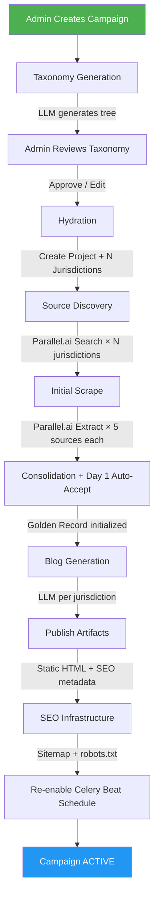
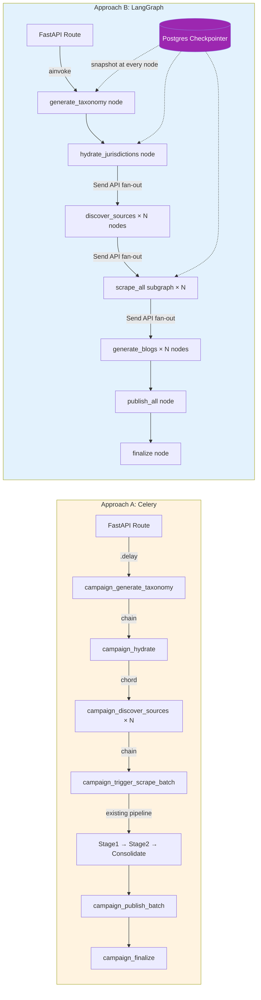
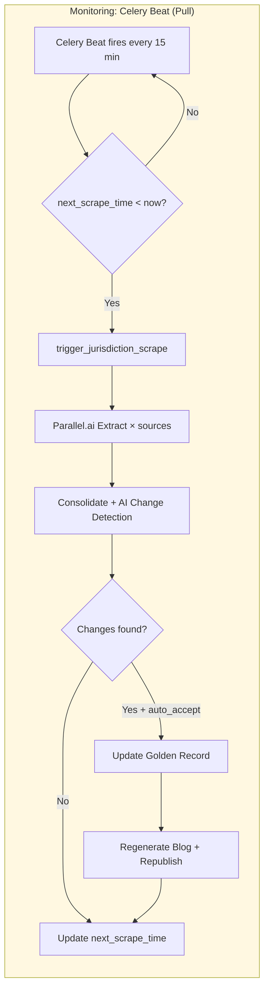
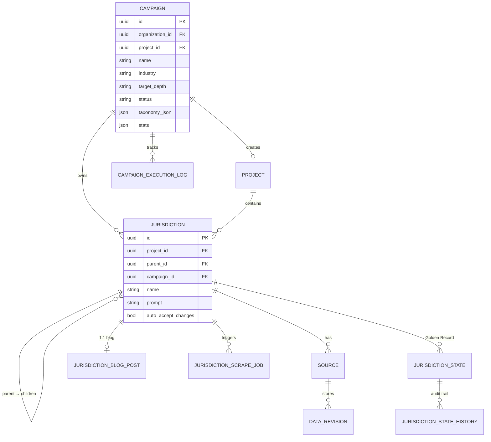
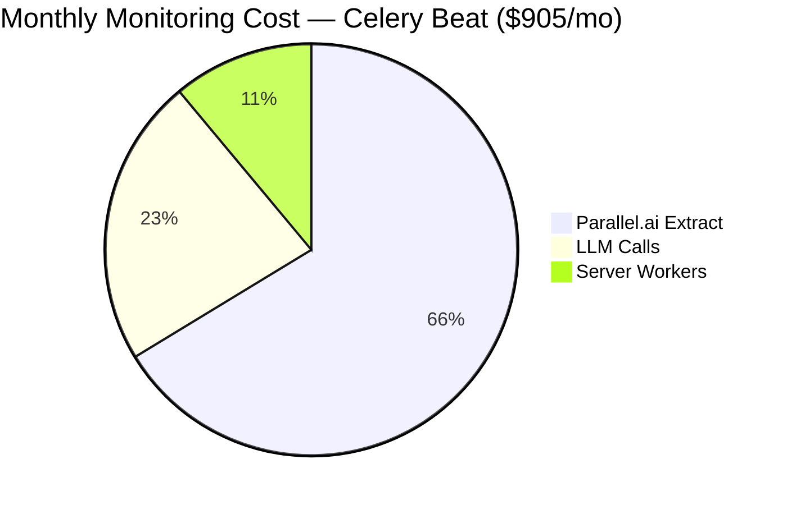
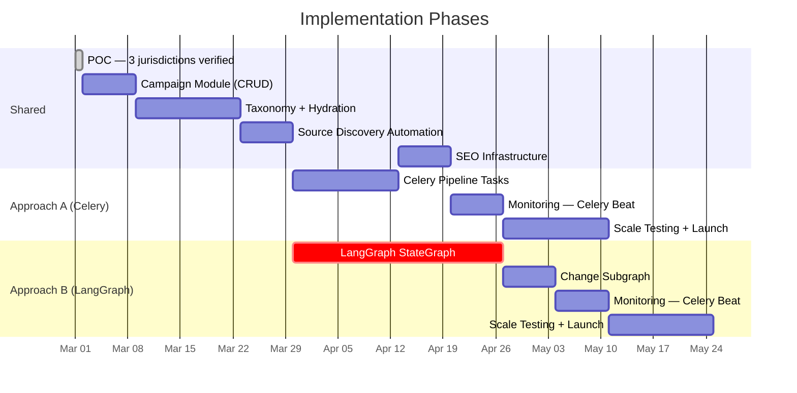

# Campaign-Driven Autonomous SEO Page Generation — Architecture Document

> **Status:** Planning  
> **Date:** February 28, 2026  
> **Authors:** Engineering Team  
> **Codebase:** `emerjent/legalwatchdog-be` (`dev` branch)

---

## Table of Contents

1. [Executive Summary](#1-executive-summary)
2. [Problem Statement](#2-problem-statement)
3. [Strategic Decision: The Pivot](#3-strategic-decision-the-pivot)
4. [Current System Architecture (As-Is)](#4-current-system-architecture-as-is)
5. [Target Architecture (To-Be)](#5-target-architecture-to-be)
6. [The Campaign Module](#6-the-campaign-module)
7. [Approach A — Celery-Based Orchestration](#7-approach-a--celery-based-orchestration)
8. [Approach B — LangGraph Agentic Orchestration](#8-approach-b--langgraph-agentic-orchestration)
9. [Monitoring Strategy — Celery Beat](#9-monitoring-strategy--celery-beat)
10. [SEO Infrastructure (Shared by Both Approaches)](#10-seo-infrastructure-shared-by-both-approaches)
11. [Data Model Changes](#11-data-model-changes)
12. [Side-by-Side Comparison](#12-side-by-side-comparison)
13. [Cost Projections](#13-cost-projections)
14. [Implementation Phases](#14-implementation-phases)
15. [Risk Matrix](#15-risk-matrix)
16. [Appendix A — Current Services Reused](#appendix-a--current-services-reused)
17. [~~Appendix B — Parallel.ai Monitor API Reference~~ (Removed)](#appendix-b--parallelai-monitor-api-reference-removed)
18. [Appendix C — LangGraph Integration Patterns](#appendix-c--langgraph-integration-patterns)

---

## 1. Executive Summary

LegalWatchdog is pivoting from a manual SaaS tool (where users configure monitoring projects) to an **autonomous SEO content engine** that generates thousands of regulatory/policy pages globally. When someone searches "EOR employment law Nigeria" or "GDPR compliance Germany," our published pages should rank in Google search results with the latest verified information.

This document defines two implementation approaches for the same goal:

- **Approach A (Celery):** Uses the existing Celery infrastructure with a new Campaign orchestration layer on top. Lower risk, faster to ship, no new dependencies.
- **Approach B (LangGraph):** Replaces the pipeline orchestration with a LangGraph `StateGraph` for agentic, stateful, checkpoint-resumable workflows. Higher capability ceiling, new dependency.

Both approaches share the same Campaign data model, the same SEO infrastructure, and both use **Celery Beat** as the monitoring backend. The existing manual project/jurisdiction flow is preserved.

**Scale target:** 5,000–10,000+ autonomously generated, monitored, and continuously updated SEO pages.

---

## 2. Problem Statement

### Current Flow (Manual, Per-Jurisdiction)

```
Human creates Organization via Swagger
  → Human creates Project with master_prompt
    → Human creates Jurisdiction with prompt
      → Human discovers sources via search endpoint
        → Human reviews and accepts sources
          → Human triggers scrape
            → System extracts + consolidates (Day 1 auto-accept)
              → Human triggers blog generation
                → Human publishes blog
```

**Time per jurisdiction:** ~15–30 minutes of manual Swagger work (as documented in `EOR.md`).

**Time for 10,000 jurisdictions:** Impossible manually.

### What's Missing

| Gap | Description |
|-----|-------------|
| **No bulk creation** | No API or script to create thousands of jurisdictions at once |
| **No automated source discovery** | Source discovery requires manual search query + review + acceptance per jurisdiction |
| **No automated blog publishing** | Blog generation is per-jurisdiction, manual trigger, manual publish toggle |
| **No sitemap** | No `sitemap.xml`, no `robots.txt` — Google cannot discover pages at scale |
| **No cross-linking** | Blog pages don't link to related jurisdictions (parent, siblings, children) |
| **No breadcrumb SEO** | No `BreadcrumbList` JSON-LD structured data |
| **No campaign concept** | No entity that represents "generate all EOR pages globally" |

---

## 3. Strategic Decision: The Pivot

| Decision | Choice | Rationale |
|----------|--------|-----------|
| **Industries** | Multi-industry from day one | EOR, Data Privacy, Corporate Tax, Trade Compliance, etc. |
| **Content strategy** | Scrape-first only | Every page requires scraped source data. No LLM-seed shortcuts. |
| **Automation level** | Fully autonomous | Auto-discover sources, auto-accept Day 1, auto-publish blogs. No human in the loop for standard operations. |
| **Scale** | 5,000–10,000+ pages | All countries + states/provinces for key markets + many topics |
| **Taxonomy** | LLM-generated | System generates the Country→State→Topic tree per industry via LLM |
| **Monitoring** | Full continuous | All jurisdictions re-checked on a rolling weekly basis |
| **Org model** | Single editorial org | Abandon multi-tenant SaaS; single system org owns all content |
| **Existing flow** | Keep all, add Campaign module | Preserve manual project/jurisdiction setup alongside new automated pipeline |

---

## 4. Current System Architecture (As-Is)

### Core Data Hierarchy

```
Organization (industry, name, settings)
  └── Project (title, master_prompt, org_id)
       └── Jurisdiction (name, prompt, parent_id → self-referential hierarchy)
            ├── Source[] (url, source_type, scrape_frequency)
            │    ├── DataRevision[] (minio_object_key, content_hash, extracted_data)
            │    └── ScrapeJob[] (status, result JSON)
            ├── JurisdictionScrapeJob[] (batch job for all sources)
            │    └── JurisdictionChange[] (per-field change records)
            ├── JurisdictionState[] (Golden Record — field_key/value pairs)
            │    └── JurisdictionStateHistory[] (immutable audit trail)
            ├── JurisdictionBlogPost (1:1 — auto-generated SEO content)
            │    └── BlogPostToken[] (search index)
            └── BlogGenerationJob[] (generation lifecycle tracking)
```

### Existing Scraping Pipeline (Celery)

```
Pipeline B (Current — Jurisdiction-Level / Golden Record)

Celery Beat → dispatch_due_jurisdictions (currently DISABLED)
  │
  ▼
JurisdictionScrapingService.trigger_jurisdiction_scrape()
  → Creates JurisdictionScrapeJob
  → Dispatches Stage 1 for ALL sources in jurisdiction
  │
  ▼
Stage 1 (scraping queue, gevent 200 concurrency):
  scrape_source_stage1 per source
  → Stage1ScrapingService: Redis lock, Parallel.ai Extract, SHA-256 dedup, MinIO upload
  → On completion: check_batch_completion()
  │
  ▼ (when all sources done)
consolidate_jurisdiction_content (processing queue):
  ConsolidatedExtractionService.execute()
  → FILTER: LLM filters irrelevant sources
  → CONSOLIDATE: Merge filtered content (100K token cap)
  → ANALYZE: LLM consolidated analysis
  │
  ├── Day 1 (empty ledger): Auto-accept → initialize JurisdictionState → trigger blog
  └── Day N (state exists): AI change detection → create JurisdictionChange records
```

### Existing Blog Pipeline

```
BlogGenerationService.generate_blog_post_sync() (Celery) / _async() (FastAPI)
  → Load jurisdiction hierarchy (Organization → Project → Jurisdiction)
  → Resolve domain_context (industry, org_type, project_prompt, jurisdiction_prompt)
  → Load JurisdictionState (Golden Record)
  → If no state → placeholder blog
  → Build state context + SHA-256 content hash
  → If hash unchanged → skip (idempotent)
  → Load JurisdictionStateHistory (change timeline)
  → LLM call (temperature=0.3, max_tokens=3000, model_preference="balanced")
  → Parse BlogLLMOutput (title, content, meta_description, keywords)
  → Generate slug: "{industry}-guide-{jurisdiction_name}"
  → Upsert JurisdictionBlogPost (Markdown + HTML)
  → Tokenize for search (NLTK)
```

### Existing Static Artifact System

```
BlogArtifactService.write_artifact()
  → Renders full HTML shell:
    • <meta name="robots" content="index, follow">
    • Open Graph tags (og:type, og:title, og:description, og:url, og:site_name)
    • Twitter Card tags
    • <link rel="canonical">
    • JSON-LD Article schema (headline, description, datePublished, publisher)
    • Markdown → HTML via fenced_code, tables, toc, nl2br, sane_lists, attr_list
  → Writes to BLOG_STATIC_DIR/{resource_path}/index.html
  → Creates legacy redirect for old slug paths
  → Served by Nginx (no FastAPI at request time)
```

### Celery Task Architecture

| Queue | Pool | Concurrency | Tasks |
|-------|------|-------------|-------|
| `scraping` | gevent | 200 | `scrape_source_stage1`, `dispatch_due_sources`, `monitor_stalled_jobs`, `retry_stuck_jobs` |
| `processing` | prefork | 4 | `process_extraction_stage2`, `detect_changes_and_notify_stage4`, `consolidate_jurisdiction_content`, notifications |
| `persistence` | prefork | 2 | `persist_results_stage3` |

**Beat schedule:** Only `rotate-due-api-keys-every-hour` is active. All scraping dispatch beats are commented out (manual trigger via API).

### Key External Services

| Service | Usage | Config Key |
|---------|-------|------------|
| Parallel.ai Search | Source discovery | `PARALLEL_API_KEY` |
| Parallel.ai Extract | Web scraping (Stage 1) | `PARALLEL_API_KEY` |
| OpenRouter | LLM gateway (extraction, blog generation) | `OPENROUTER_API_KEY` |
| MinIO | Raw content storage | `MINIO_ENDPOINT` |
| PostgreSQL | Primary database (async via asyncpg) | `DATABASE_URL` |
| Redis | Celery broker/backend, caching, locks, pub/sub | `REDIS_URL` |
| Nginx | Static blog artifact serving | `BLOG_STATIC_DIR` |

---

## 5. Target Architecture (To-Be)

### High-Level Flow (Both Approaches)

```
Admin creates Campaign("EOR", description, target_depth=STATE)
         │
         ▼
   ┌─────────────┐
   │  TAXONOMY    │  LLM generates: Country→State→Topic tree
   │  GENERATION  │  Output: structured JSON with names, prompts, search queries
   └──────┬──────┘
          │
          ▼
   ┌─────────────┐
   │  HYDRATION   │  Create Project + N Jurisdictions from taxonomy tree
   │              │  Using existing JurisdictionService.create()
   └──────┬──────┘
          │
          ▼
   ┌─────────────┐
   │   SOURCE     │  For each jurisdiction: Parallel.ai Search → auto-accept top N
   │  DISCOVERY   │  Using existing SourceDiscoveryService.suggest_sources()
   └──────┬──────┘
          │
          ▼
   ┌─────────────┐
   │  INITIAL     │  Scrape all sources → consolidate → LLM extract → Day 1 auto-accept
   │   SCRAPE     │  Using existing Pipeline B (trigger_jurisdiction_scrape → consolidate)
   └──────┬──────┘
          │
          ▼
   ┌─────────────┐
   │    BLOG      │  Generate blog per jurisdiction from Golden Record
   │  GENERATION  │  Using existing BlogGenerationService
   └──────┬──────┘
          │
          ▼
   ┌─────────────┐
   │   PUBLISH    │  Publish artifacts + write sitemap + cross-linking
   │   + SEO      │  Enhanced BlogArtifactService + new SitemapService
   └──────┬──────┘
          │
          ▼
   ┌─────────────┐
   │  MONITORING  │  Celery Beat re-scrape cycle (per jurisdiction cadence)
   └─────────────┘
          │
          ▼ (on change detected)
   ┌─────────────┐
   │   CHANGE     │  Auto-accept → update Golden Record → regenerate blog → republish
   │  PROCESSING  │
   └─────────────┘
```

### Campaign Pipeline — End-to-End Flow



#### Eraser Diagram


[Edit this diagram in Eraser](https://app.eraser.io/new?requestId=nYxvroclobwSheuRFwia&state=CYehYfgVQQ946NJ9rcxDN)

### Approach A vs Approach B — Orchestration Comparison



#### Eraser Diagram


[Edit this diagram in Eraser](https://app.eraser.io/new?requestId=yg07CCkQxSTvjTk3I3a9&state=FhdM_iVQUOCTjc8Vv8tL4)

### What Gets Created

| Entity | Count (10K campaign) | How |
|--------|---------------------|-----|
| Organization | 1 | One-time editorial org setup |
| Campaign | 1 per industry | Manual creation via API |
| Project | 1 per campaign | Auto-created during hydration |
| Jurisdiction (top-level) | ~195 (countries) | Auto-created from taxonomy |
| Jurisdiction (children) | ~5,000–10,000 | Auto-created (states, topics) |
| Source | ~25,000–50,000 | Auto-discovered (5 per jurisdiction) |
| JurisdictionBlogPost | ~5,000–10,000 | Auto-generated (1 per jurisdiction) |
| Static HTML artifact | ~5,000–10,000 | Auto-published |

---

## 6. The Campaign Module

> **Shared by both Approach A and Approach B.** The Campaign module is the same regardless of orchestration engine.

### New Module Structure

```
app/api/modules/v1/campaigns/
├── models/
│   ├── campaign_model.py           # Campaign, CampaignExecutionLog
│   └── __init__.py
├── schemas/
│   ├── campaign_schema.py          # Create, Update, Response schemas
│   └── __init__.py
├── service/
│   ├── campaign_service.py         # CRUD + orchestration dispatch
│   ├── taxonomy_generation_service.py  # LLM taxonomy generation
│   ├── taxonomy_geo_validator.py   # Canonical geo normalization (ISO 3166)
│   ├── campaign_hydration_service.py   # Jurisdiction tree creation
│   ├── campaign_source_discovery_service.py  # Batch source discovery
│   ├── campaign_monitor_service.py     # Celery Beat schedule management (no-op on activate)
│   └── __init__.py
├── routes/
│   ├── campaign_routes.py
│   ├── docs/
│   │   └── campaign_routes_docs.py
│   └── __init__.py
└── __init__.py
```

### Campaign Model

```python
class CampaignStatus(str, Enum):
    DRAFT = "draft"
    GENERATING_TAXONOMY = "generating_taxonomy"
    TAXONOMY_READY = "taxonomy_ready"
    HYDRATING = "hydrating"
    DISCOVERING_SOURCES = "discovering_sources"
    SCRAPING = "scraping"
    GENERATING_BLOGS = "generating_blogs"
    PUBLISHING = "publishing"
    SETTING_UP_MONITORS = "setting_up_monitors"
    ACTIVE = "active"                   # Fully deployed, monitoring running
    PAUSED = "paused"
    FAILED = "failed"

class CampaignTargetDepth(str, Enum):
    COUNTRY = "country"                 # ~195 jurisdictions
    STATE = "state"                     # ~2,000-5,000 jurisdictions
    CITY = "city"                       # ~10,000+ jurisdictions

class CampaignMonitorBackend(str, Enum):
    CELERY_BEAT = "celery_beat"         # Sole monitoring backend (Parallel.ai Monitor removed)

class Campaign(SQLModel, table=True):
    __tablename__ = "campaigns"

    id: UUID                            # PK
    organization_id: UUID               # FK → organizations.id
    project_id: Optional[UUID]          # FK → projects.id (created during hydration)
    name: str                           # "Global EOR Compliance"
    industry: str                       # "EOR", "Data Privacy", "Corporate Tax"
    domain_description: str             # Detailed prompt for taxonomy generation
    target_depth: CampaignTargetDepth   # How deep to go
    monitor_backend: CampaignMonitorBackend  # Which monitoring system to use
    status: CampaignStatus              # Current pipeline phase
    taxonomy_json: Optional[Dict]       # LLM-generated taxonomy tree
    stats: Dict                         # {total_jurisdictions, sources_discovered, ...}
    monitor_cadence: str                # "weekly" (for both backends)
    sources_per_jurisdiction: int       # Default 5
    max_jurisdictions: int              # Safety cap per run (e.g., 15000)
    created_at: datetime
    updated_at: datetime

    # Audit & Approval Fields
    created_by: UUID                    # FK → users.id (admin who created)
    taxonomy_approved_by: Optional[UUID]  # FK → users.id (admin who approved taxonomy)
    taxonomy_approved_at: Optional[datetime]  # When taxonomy was approved
    launched_by: Optional[UUID]         # FK → users.id (admin who triggered launch)
    generation_model: Optional[str]     # LLM model used (e.g., "google/gemini-2.5-flash")
    generation_config_snapshot: Optional[Dict]  # Frozen copy of config at generation time
```

### Campaign Execution Log

```python
class CampaignExecutionLog(SQLModel, table=True):
    __tablename__ = "campaign_execution_logs"

    id: UUID
    campaign_id: UUID                   # FK → campaigns.id
    phase: str                          # Matches CampaignStatus values
    started_at: datetime
    completed_at: Optional[datetime]
    total_items: int                    # e.g., 5000 jurisdictions to create
    completed_items: int                # e.g., 3200 created so far
    failed_items: int
    error_log: Optional[Dict]           # JSONB — details of failures
```

### Campaign Routes

> **All campaign routes require superadmin permissions.** This is enforced via `Depends(get_current_superadmin)` on every route handler. Campaigns are an internal editorial tool — not exposed to regular users.

| Method | Path | Auth | Description |
|--------|------|------|-------------|
| `POST` | `/campaigns` | Superadmin | Create campaign (name, industry, domain_description, target_depth, monitor_backend) |
| `GET` | `/campaigns` | Superadmin | List all campaigns with stats |
| `GET` | `/campaigns/{id}` | Superadmin | Campaign details + execution logs |
| `POST` | `/campaigns/{id}/generate-taxonomy` | Superadmin | Trigger LLM taxonomy generation (returns 202) |
| `GET` | `/campaigns/{id}/taxonomy` | Superadmin | View generated taxonomy tree (includes geo validation warnings) |
| `PATCH` | `/campaigns/{id}/taxonomy` | Superadmin | Edit taxonomy nodes before launch |
| `POST` | `/campaigns/{id}/approve-taxonomy` | Superadmin | Approve taxonomy (records `taxonomy_approved_by` + timestamp) |
| `POST` | `/campaigns/{id}/launch` | Superadmin | Start full pipeline (requires approved taxonomy) |
| `GET` | `/campaigns/{id}/status` | Superadmin | Real-time progress across all phases |
| `POST` | `/campaigns/{id}/pause` | Superadmin | Pause monitoring |
| `POST` | `/campaigns/{id}/resume` | Superadmin | Resume monitoring |
| `GET` | `/campaigns/{id}/dashboard` | Superadmin | Stats: pages published, changes detected, costs |

**Execution modes:**

| Mode | Flow | Use Case |
|------|------|----------|
| **CLI / Fast mode** | `POST /campaigns` → `POST /generate-taxonomy` → `POST /approve-taxonomy` → `POST /launch` | Internal bulk generation, scripted runs |
| **Admin UI / Safe mode** | `POST /campaigns` → `POST /generate-taxonomy` → `GET /taxonomy` (preview: "This will create 1 project, 15 countries, 180 states") → `PATCH /taxonomy` (edit) → `POST /approve-taxonomy` → `POST /launch` | Safer, preview before committing |

**Route handler pattern:**

```python
@router.post("/{campaign_id}/launch", status_code=202)
async def launch_campaign(
    campaign_id: UUID,
    db: AsyncSession = Depends(get_db),
    current_user: User = Depends(get_current_superadmin),  # Admin-only
):
    """Launch campaign pipeline. Requires approved taxonomy."""
    service = CampaignService(db)
    result = await service.launch(
        campaign_id=campaign_id,
        launched_by=current_user.id,  # Audit trail
    )
    return success_response(
        status_code=202,
        message="Campaign launch initiated",
        data=result,
    )
```

### Taxonomy Generation Service

This service calls the LLM to generate a structured JSON taxonomy tree for a given industry.

**Input:** `Campaign.industry` + `Campaign.domain_description` + `Campaign.target_depth`

**LLM Prompt (conceptual):**

```
You are a regulatory domain expert. Generate a comprehensive taxonomy tree for
monitoring {industry} regulations globally.

Target depth: {target_depth}

For each node, provide:
- name: Country/state/topic name (e.g., "United States", "California", "Minimum Wage")
- description: Brief scope description
- suggested_prompt: AI extraction prompt scoped to this jurisdiction
  (what fields to extract, what to focus on)
- suggested_search_queries: Array of 2-3 search queries for source discovery
  (e.g., ["California minimum wage law 2026", "CA labor code employment regulations"])

Output format: JSON tree with structure:
{
  "nodes": [
    {
      "name": "United States",
      "description": "Federal employment regulations",
      "suggested_prompt": "Extract federal EOR compliance fields...",
      "suggested_search_queries": ["US federal employment law", "FLSA regulations 2026"],
      "children": [
        {
          "name": "California",
          "description": "California state employment overlays",
          "suggested_prompt": "Extract California-specific EOR fields...",
          "suggested_search_queries": ["California labor code 2026"],
          "children": [...]
        }
      ]
    }
  ]
}

Requirements:
- Include ALL countries with significant regulatory frameworks for {industry}
- For major economies (US, UK, EU member states, India, China, Brazil, Nigeria, etc.),
  include state/province level nodes
- Each suggested_prompt should focus on fields SPECIFIC to that jurisdiction level
  (child nodes should NOT repeat parent-level fields — see Nigeria Lagos pattern in EOR.md)
- suggested_search_queries should target authoritative government and professional sources
```

**Output stored in:** `Campaign.taxonomy_json`

**Validation rules applied post-generation:**
- Deduplicate names at same level
- Enforce max name length (255 chars)
- Validate no circular references
- Cap depth per `target_depth` setting
- Ensure every node has at least one `suggested_search_query`
- Enforce `max_jurisdictions` cap — reject taxonomy if total node count exceeds limit

**Canonical Geo Normalization (post-validation):**

After LLM generates the taxonomy, the `TaxonomyGeoValidator` cross-references every node against canonical geo datasets to prevent AI-invented regions and normalize naming:

```python
# service/taxonomy_geo_validator.py

class TaxonomyGeoValidator:
    """Validates and normalizes LLM-generated taxonomy against canonical geo data."""

    # Canonical reference datasets
    COUNTRY_ALIASES = {
        "USA": "United States", "UK": "United Kingdom",
        "UAE": "United Arab Emirates", "South Korea": "Republic of Korea",
        # ... full ISO 3166-1 name mapping
    }

    async def validate_and_normalize(self, taxonomy: dict) -> GeoValidationResult:
        """Cross-reference taxonomy nodes against canonical geo data.

        Steps:
        1. Validate country names against ISO 3166-1 alpha-2 code list
        2. Validate state/province names against ISO 3166-2 subdivision codes
        3. Normalize aliases ("USA" → "United States", "UK" → "United Kingdom")
        4. Flag unrecognized entities (potential LLM hallucinations)
        5. Attach ISO codes to each node for downstream slug generation

        Args:
            taxonomy: LLM-generated taxonomy JSON tree.

        Returns:
            GeoValidationResult with normalized tree, warnings, and rejected nodes.
        """
        ...

    async def _resolve_country(self, name: str) -> Optional[GeoEntity]:
        """Match country name against ISO 3166-1."""
        # Exact match → alias match → fuzzy match (>90% similarity)
        ...

    async def _resolve_subdivision(self, name: str, country_code: str) -> Optional[GeoEntity]:
        """Match state/province against ISO 3166-2 for given country."""
        ...
```

**Normalization examples:**

| LLM Output | Normalized To | ISO Code | Action |
|-----------|---------------|----------|--------|
| "USA" | "United States" | US | Alias resolved |
| "England" | "England" | GB-ENG | ISO 3166-2 matched |
| "Californnia" (typo) | "California" | US-CA | Fuzzy matched (>90%) |
| "North Zambonia" | ❌ Flagged | — | Rejected (no ISO match) |
| "Lagos" | "Lagos" | NG-LA | ISO 3166-2 matched |

**Behavior on validation:**
- **Recognized entities:** Normalized name + ISO code attached
- **Alias matches:** Auto-corrected silently
- **Fuzzy matches (>90% similarity):** Auto-corrected, logged as warning
- **Unrecognized entities:** Flagged in `GeoValidationResult.warnings` for admin review; NOT auto-rejected (some legitimate jurisdictions may not have ISO codes, e.g., special economic zones)

**Data source options:**
- `pycountry` package (built-in ISO 3166-1 + ISO 3166-2 data)
- Bundled JSON lookup files (vendored for offline reliability)
- Future: GeoNames API for city-level validation

**Review step:** After generation + geo validation, status moves to `TAXONOMY_READY`. Admin can review the normalized taxonomy (including any warnings about unrecognized entities) and edit via `PATCH /campaigns/{id}/taxonomy` before calling `POST /campaigns/{id}/launch`.

### Hydration Service

Walks the taxonomy tree and creates real database records:

```
For each node in taxonomy_json (depth-first):
  1. Create Jurisdiction:
     - name = node.name
     - parent_id = parent jurisdiction's ID (None for top-level)
     - prompt = node.suggested_prompt
     - description = node.description
     - project_id = campaign.project_id (created at start)
     - enable_auto_scrape = True
     - scrape_frequency = campaign.monitor_cadence (e.g., WEEKLY)
  2. Store mapping: taxonomy_node → jurisdiction_id
  3. Batch commit every 100 jurisdictions
```

**Uses existing:** `Jurisdiction` model, `UniqueConstraint("project_id", "parent_id", "name")`, `validate_hierarchy` event listener.

### Source Discovery Service

For each jurisdiction created during hydration:

```
1. Build search query from: jurisdiction.prompt + jurisdiction.name
2. Call SourceDiscoveryService.suggest_sources(
     search_query=jurisdiction.prompt,  # or first suggested_search_query
     jurisdiction_name=jurisdiction.name,
     max_results=campaign.sources_per_jurisdiction
   )
3. Auto-accept top N results → SourceService.create_source()
4. Rate limit: 2-second delay between Parallel.ai Search calls
```

**Uses existing:** `SourceDiscoveryService._build_objective()`, `_execute_parallel_search()`, `SourceService.bulk_create_sources()`

---

## 7. Approach A — Celery-Based Orchestration

> Use the existing Celery infrastructure. Add new campaign-specific tasks that chain the pipeline together.

### Architecture Diagram

```
┌─────────────────────────────────────────────────────────────────┐
│                    FastAPI (Campaign Routes)                      │
│                                                                  │
│  POST /campaigns/{id}/launch                                     │
│    → CampaignService.launch()                                    │
│    → Dispatches: campaign_generate_taxonomy.delay(campaign_id)    │
└──────────────────┬──────────────────────────────────────────────┘
                   │
┌──────────────────▼──────────────────────────────────────────────┐
│              CELERY: processing queue                             │
│                                                                  │
│  campaign_generate_taxonomy                                      │
│    → TaxonomyGenerationService.generate(campaign_id)             │
│    → On success: campaign_hydrate.delay(campaign_id)             │
│                                                                  │
│  campaign_hydrate                                                │
│    → CampaignHydrationService.hydrate(campaign_id)               │
│    → Creates Project + N Jurisdictions                           │
│    → On success: dispatch campaign_discover_sources_batch         │
│                                                                  │
│  campaign_discover_sources_batch                                 │
│    → For each batch of 50 jurisdictions:                         │
│      campaign_discover_sources_single.delay(jurisdiction_id)     │
│    → Uses Celery chord: batch tasks → callback                   │
│                                                                  │
│  campaign_discover_sources_single                                │
│    → SourceDiscoveryService.suggest_sources()                    │
│    → Auto-accept top N sources                                   │
│    → Rate limited: 2s delay                                      │
│                                                                  │
│  campaign_trigger_scrape_batch                                   │
│    → For each batch of 100 jurisdictions:                        │
│      JurisdictionScrapingService.trigger_jurisdiction_scrape()   │
│    → Existing pipeline takes over:                               │
│      scrape_source_stage1 → check_batch → consolidate            │
│      → Day 1 auto-accept → blog generation                      │
│                                                                  │
│  campaign_publish_batch                                          │
│    → For each jurisdiction with generated blog:                  │
│      BlogGenerationService + BlogArtifactService.write_artifact()│
│    → Trigger sitemap regeneration                                │
│                                                                  │
│  campaign_setup_monitors (no-op — Celery Beat handles ongoing monitoring)│
│    → Parallel.ai Monitor API removed (March 1, 2026)                      │
│                                                                  │
│  campaign_finalize                                               │
│    → Set Campaign.status = ACTIVE                                │
│    → Generate sitemap.xml                                        │
│    → Generate robots.txt                                         │
│    → Log completion stats                                        │
└─────────────────────────────────────────────────────────────────┘
                   │
┌──────────────────▼──────────────────────────────────────────────┐
│         CELERY: scraping queue (existing, unchanged)             │
│                                                                  │
│  scrape_source_stage1 (per source, gevent pool)                  │
│  → Parallel.ai Extract                                           │
│  → MinIO upload                                                  │
│  → SHA-256 dedup                                                 │
│  → check_batch_completion() → consolidate_jurisdiction_content   │
└─────────────────────────────────────────────────────────────────┘
                   │
┌──────────────────▼──────────────────────────────────────────────┐
│         Ongoing Monitoring (Option A: Celery Beat)               │
│                                                                  │
│  RE-ENABLE beat schedule:                                        │
│    dispatch_due_jurisdictions: every 15 minutes                  │
│                                                                  │
│  Existing pipeline handles everything:                           │
│    → Finds jurisdictions where next_scrape_time < now            │
│    → Triggers scrape → consolidate → change detection            │
│                                                                  │
│  NEW: For Campaign-managed jurisdictions (campaign_id IS NOT NULL│
│  AND auto_accept_changes = True):                                │
│    → Auto-accept detected changes                                │
│    → Update JurisdictionState (Golden Record)                    │
│    → Regenerate blog                                             │
│    → Republish artifact                                          │
│    → Trigger sitemap rebuild (debounced)                         │
│                                                                  │
│  For non-Campaign jurisdictions (manual flow):                   │
│    → Create JurisdictionChange records (existing behavior)       │
│    → Wait for human acceptance                                   │
└─────────────────────────────────────────────────────────────────┘
```

### New Celery Tasks

| Task | Queue | Trigger | Purpose |
|------|-------|---------|---------|
| `campaign_generate_taxonomy` | `processing` | `POST /campaigns/{id}/launch` | LLM taxonomy generation |
| `campaign_hydrate` | `processing` | After taxonomy | Create Project + Jurisdictions |
| `campaign_discover_sources_batch` | `processing` | After hydration | Coordinate source discovery |
| `campaign_discover_sources_single` | `processing` | Per jurisdiction | Individual source discovery |
| `campaign_trigger_scrape_batch` | `processing` | After sources discovered | Dispatch initial scrapes |
| `campaign_publish_batch` | `processing` | After blogs generated | Batch publish + sitemap |
| `campaign_setup_monitors` | `processing` | After publish | No-op (Celery Beat schedule enabled on ACTIVE) |
| `campaign_finalize` | `processing` | After monitors step | Mark campaign ACTIVE |

### Task Chaining Pattern

```python
from celery import chain, chord, group

# Full campaign pipeline
pipeline = chain(
    campaign_generate_taxonomy.si(campaign_id),
    campaign_hydrate.si(campaign_id),
    campaign_discover_sources_batch.si(campaign_id),
    campaign_trigger_scrape_batch.si(campaign_id),
    # Scraping → consolidation → blog happens via existing pipeline
    # campaign_publish_batch triggered by polling/callback
    campaign_setup_monitors.si(campaign_id),
    campaign_finalize.si(campaign_id),
)
pipeline.delay()
```

### Progress Tracking

Each task updates `CampaignExecutionLog` at start/completion:

```python
# Inside campaign_discover_sources_batch:
log = CampaignExecutionLog(
    campaign_id=campaign_id,
    phase="discovering_sources",
    started_at=datetime.now(timezone.utc),
    total_items=total_jurisdictions,
    completed_items=0,
    failed_items=0,
)
db.add(log)
db.commit()

# After each jurisdiction completes:
log.completed_items += 1
db.commit()
```

### Run Correlation Baseline (Phase 0)

To improve observability and make retries/resumes diagnosable, each campaign launch now
generates a `run_id` correlation key at orchestration time.

- Stored under `Campaign.stats.pipeline_control.run_id`
- Propagated through Celery chain task signatures
- Included in Redis progress payloads (`campaign_progress:{campaign_id}`)
- Included in campaign pipeline error logs (`CampaignExecutionLog.error_log.run_id`)
- Threaded into taxonomy LLM usage tracking via `LLMUsageLog.request_id`

This is intentionally schema-compatible (no migration required) and provides a stable
join key across orchestration metadata, progress streams, and usage logs.

### AI Rollout Flags (Phase 0)

Initial feature flags are available to control planner/tool-calling rollout safely:

- `CAMPAIGN_AI_ROLLOUT_ENABLED`
- `CAMPAIGN_AI_PLANNER_BACKEND` (`none` | `shadow` | `active`)
- `CAMPAIGN_AI_TOOL_POLICY_MODE` (`off` | `allowlist` | `strict`)
- `CAMPAIGN_AI_MAX_TOOL_CALLS_PER_JURISDICTION`
- `CAMPAIGN_AI_TOOL_CALL_TIMEOUT_SECONDS`

Production should start in `shadow` planner mode and `allowlist` policy mode before
moving to `active` planner execution.

### Error Handling & Resume

- Each task has `max_retries=3`, `default_retry_delay=60`
- On failure: set `Campaign.status = FAILED`, log error to `CampaignExecutionLog`
- Resume: `POST /campaigns/{id}/launch` checks current status and resumes from the failed phase
- Uses Redis distributed locks (existing pattern) to prevent duplicate campaign executions

### Key Limitation: No Built-In Checkpointing

If a task dies mid-execution (e.g., `campaign_hydrate` created 3,000 of 5,000 jurisdictions then OOM-killed), the task retries from scratch. Mitigation:

- Hydration task is **idempotent**: `UniqueConstraint("project_id", "parent_id", "name")` prevents duplicates — the retry skips already-created jurisdictions
- Source discovery is idempotent: creating a source for an already-sourced jurisdiction skips via URL dedup
- Blog generation is idempotent: content hash check skips unchanged jurisdictions

### Pros

- **Zero new dependencies** — uses existing Celery, Redis, PostgreSQL
- **Team familiarity** — everyone knows Celery task patterns
- **Proven at scale** — Celery with gevent handles 200 concurrent scrapes today
- **Faster to ship** — estimated 6–8 weeks vs 10–13 for LangGraph

### Cons

- **Manual state management** — pipeline state tracked via `Campaign.status` enum + `CampaignExecutionLog`; no automatic checkpointing
- **No built-in resume** — must manually implement idempotency and skip-logic for each task
- **Rigid chaining** — Celery chains are linear; dynamic branching (e.g., different processing for HIGH risk changes) requires custom if/else in tasks
- **No time-travel debugging** — cannot replay a specific campaign execution step-by-step
- **Fan-out complexity** — Celery chords for 10,000 jurisdiction source discovery are fragile (Redis backend chord counter can get lost)

---

## 8. Approach B — LangGraph Agentic Orchestration

> Replace pipe orchestration with a LangGraph StateGraph. Each pipeline phase becomes a graph node. Built-in checkpointing, resume, and dynamic fan-out.

### New Dependencies

```toml
# Add to pyproject.toml [project.dependencies]
langgraph = ">=0.4"
langgraph-checkpoint-postgres = ">=2.0"
langchain-core = ">=0.3"
langsmith = ">=0.2"  # Optional: observability
```

### Architecture Diagram

```
┌─────────────────────────────────────────────────────────────────┐
│                    FastAPI (Campaign Routes)                      │
│                                                                  │
│  POST /campaigns/{id}/launch                                     │
│    → Invoke compiled LangGraph campaign_graph                    │
│    → graph.ainvoke({"campaign_id": id}, config={"thread_id": id})│
│    → Returns immediately (background execution via thread)       │
└──────────────────┬──────────────────────────────────────────────┘
                   │
┌──────────────────▼──────────────────────────────────────────────┐
│              LANGGRAPH: Campaign Orchestrator Graph               │
│              (AsyncPostgresSaver checkpointer)                   │
│                                                                  │
│  State: CampaignGraphState(TypedDict)                            │
│    campaign_id: str                                              │
│    taxonomy: dict                                                │
│    jurisdiction_ids: list[str]                                   │
│    jurisdiction_source_map: dict[str, list[str]]                 │
│    scrape_results: dict[str, str]   # jid → status              │
│    blog_results: dict[str, str]     # jid → slug                │
│    monitor_ids: dict[str, str]      # unused — Parallel.ai Monitor removed       │
│    phase: str                                                    │
│    errors: list[dict]                                            │
│                                                                  │
│  NODES:                                                          │
│  ┌──────────────────┐                                            │
│  │ generate_taxonomy │ LLMManager → structured JSON taxonomy     │
│  └────────┬─────────┘                                            │
│           │                                                      │
│  ┌────────▼─────────┐                                            │
│  │ hydrate_jurisd.  │ Walk tree → JurisdictionService.create()   │
│  └────────┬─────────┘ Batch commit (100 per txn)                 │
│           │                                                      │
│  ┌────────▼─────────┐                                            │
│  │ discover_sources │ Send API fan-out → N parallel discoveries  │
│  │ (dynamic fan-out)│ SourceDiscoveryService.suggest_sources()   │
│  └────────┬─────────┘ Auto-accept top N → SourceService.create() │
│           │                                                      │
│  ┌────────▼─────────┐                                            │
│  │ scrape_all       │ Send API fan-out → N parallel scrapes      │
│  │ (per-jurisdiction│ trigger_jurisdiction_scrape() per jid      │
│  │  subgraph)       │                                            │
│  │  ┌─────────┐     │                                            │
│  │  │ scrape  │     │ Parallel.ai Extract (existing Stage 1)     │
│  │  │ extract │     │ LLM extraction (existing AIExtraction)     │
│  │  │ consol. │     │ ConsolidatedExtractionService.execute()    │
│  │  │ accept  │     │ Day 1 auto-accept → initialize_state()    │
│  │  └─────────┘     │                                            │
│  └────────┬─────────┘                                            │
│           │                                                      │
│  ┌────────▼─────────┐                                            │
│  │ generate_blogs   │ Send API fan-out → N parallel blog gens   │
│  │                  │ BlogGenerationService (async version)      │
│  └────────┬─────────┘                                            │
│           │                                                      │
│  ┌────────▼─────────┐                                            │
│  │ publish_all      │ BlogArtifactService.write_artifact()       │
│  │                  │ Cross-linking injection                    │
│  └────────┬─────────┘                                            │
│           │                                                      │
│  ┌────────▼─────────┐                                            │
│  │ setup_monitors   │ No-op — Celery Beat handles monitoring     │
│  │                  │ Parallel.ai Monitor removed (2026-03-01)  │
│  └────────┬─────────┘                                            │
│           │                                                      │
│  ┌────────▼─────────┐                                            │
│  │ generate_seo     │ SitemapService + robots.txt                │
│  └────────┬─────────┘                                            │
│           │                                                      │
│  ┌────────▼─────────┐                                            │
│  │ finalize         │ Campaign.status = ACTIVE                   │
│  └──────────────────┘                                            │
│                                                                  │
│  EDGES:                                                          │
│  generate_taxonomy → hydrate_jurisdictions                       │
│  hydrate_jurisdictions → discover_sources (via Send API)         │
│  discover_sources → scrape_all (via Send API)                    │
│  scrape_all → generate_blogs (via Send API)                      │
│  generate_blogs → publish_all (via Send API)                     │
│  publish_all → setup_monitors (conditional)                      │
│  setup_monitors → generate_seo                                   │
│  generate_seo → finalize                                         │
│                                                                  │
│  CHECKPOINTER: AsyncPostgresSaver                                │
│    → Snapshots state at every node boundary                      │
│    → Shares PostgreSQL with application DB (separate schema)     │
│    → Pooled connections (shared with FastAPI async pool)          │
└─────────────────────────────────────────────────────────────────┘
                   │
┌──────────────────▼──────────────────────────────────────────────┐
│         LANGGRAPH: Change Processing Subgraph                    │
│         (triggered by webhook or Celery Beat)                    │
│                                                                  │
│  State: ChangeProcessingState(TypedDict)                         │
│    jurisdiction_id: str                                          │
│    event_data: dict           # from webhook or scrape result    │
│    current_state: dict        # Golden Record snapshot           │
│    changes_detected: list     # field-level changes              │
│    risk_level: str                                               │
│    blog_regenerated: bool                                        │
│                                                                  │
│  NODES:                                                          │
│  ┌──────────────────┐                                            │
│  │ parse_event      │ Extract structured data from trigger       │
│  └────────┬─────────┘                                            │
│           │                                                      │
│  ┌────────▼─────────┐                                            │
│  │ load_golden_rec. │ JurisdictionStateService.get_state_map()   │
│  └────────┬─────────┘                                            │
│           │                                                      │
│  ┌────────▼─────────┐                                            │
│  │ detect_changes   │ AI diff: new data vs Golden Record         │
│  └────────┬─────────┘                                            │
│           │                                                      │
│     ┌─────┴──────┐                                               │
│     │ Conditional │                                              │
│     │   Edge      │                                              │
│     └─────┬──────┘                                               │
│     ┌─────┴──────────┐                                           │
│     ▼                ▼                                           │
│  risk=HIGH      risk=LOW/MED                                     │
│  ┌──────────┐  ┌──────────┐                                      │
│  │interrupt │  │auto_accept│ Update Golden Record                │
│  │(human    │  │          │ JurisdictionStateService.update_state│
│  │ review)  │  └────┬─────┘                                      │
│  └──────────┘       │                                            │
│                ┌────▼─────┐                                      │
│                │regen_blog│ BlogGenerationService                 │
│                └────┬─────┘                                      │
│                ┌────▼─────┐                                      │
│                │republish │ BlogArtifactService.write_artifact()  │
│                └────┬─────┘                                      │
│                ┌────▼─────┐                                      │
│                │update_seo│ Sitemap rebuild (debounced)           │
│                └──────────┘                                      │
└─────────────────────────────────────────────────────────────────┘
                   │
┌──────────────────▼──────────────────────────────────────────────┐
│         CELERY (reduced scope — kept for simple tasks)           │
│                                                                  │
│  KEPT:                                                           │
│  • send_revision_notifications (processing queue)                │
│  • send_internal_user_notification (processing queue)            │
│  • send_external_participant_notification (processing queue)     │
│  • rotate_due_keys (processing queue, hourly beat)               │
│  • sitemap_rebuild_debounced (processing queue)                  │
│  • WebSocket event bridge                                        │
│                                                                  │
│  MOVED TO LANGGRAPH (if Approach B chosen):                      │
│  • scrape_source_stage1 → LangGraph scrape node                  │
│  • process_extraction_stage2 → LangGraph extract node            │
│  • persist_results_stage3 → LangGraph consolidate node           │
│  • detect_changes_and_notify_stage4 → LangGraph change subgraph  │
│  • consolidate_jurisdiction_content → LangGraph consolidate node │
│  • dispatch_due_jurisdictions → LangGraph or Celery Beat         │
│                                                                  │
│  ELIMINATED (with Parallel.ai Monitor):                          │
│  • dispatch_due_sources                                          │
│  • monitor_stalled_jobs                                          │
│  • retry_stuck_jobs                                              │
└─────────────────────────────────────────────────────────────────┘
```

#### Eraser Diagram


[Edit this diagram in Eraser](https://app.eraser.io/new?requestId=OBmaDgSFoSmsqQeWcRIU&state=HwSwOH47B2xggxkbg6Aur)

### LangGraph Graph Definition (Pseudocode)

```python
from langgraph.graph import StateGraph, Send, END
from langgraph.checkpoint.postgres.aio import AsyncPostgresSaver
from typing import TypedDict, Annotated
from operator import add

class CampaignGraphState(TypedDict):
    campaign_id: str
    taxonomy: dict
    jurisdiction_ids: Annotated[list[str], add]  # append-merge
    phase: str
    errors: Annotated[list[dict], add]

# ── Node functions ──
async def generate_taxonomy(state: CampaignGraphState) -> dict:
    """Call LLM to generate industry taxonomy tree."""
    campaign = await load_campaign(state["campaign_id"])
    taxonomy = await TaxonomyGenerationService().generate(
        industry=campaign.industry,
        domain_description=campaign.domain_description,
        target_depth=campaign.target_depth,
    )
    return {"taxonomy": taxonomy, "phase": "taxonomy_ready"}

async def hydrate_jurisdictions(state: CampaignGraphState) -> dict:
    """Create Project + Jurisdiction records from taxonomy."""
    jids = await CampaignHydrationService().hydrate(
        campaign_id=state["campaign_id"],
        taxonomy=state["taxonomy"],
    )
    return {"jurisdiction_ids": jids, "phase": "hydrating"}

DISCOVERY_BATCH_SIZE = 50  # Limits concurrent DB connections and Parallel.ai API exposure

def fan_out_discovery(state: CampaignGraphState) -> list[Send]:
    """Dynamic fan-out: one discovery task per batch of jurisdictions.

    Batches of DISCOVERY_BATCH_SIZE (default 50) are used instead of one Send
    per jurisdiction to avoid memory pressure and excessive concurrency at
    10,000+ jurisdiction scale. Each batch is processed sequentially within the
    node, while batches themselves run in parallel via the Send API.
    """
    jids = state["jurisdiction_ids"]
    batches = [jids[i:i + DISCOVERY_BATCH_SIZE] for i in range(0, len(jids), DISCOVERY_BATCH_SIZE)]
    return [
        Send("discover_sources_batch", {
            "campaign_id": state["campaign_id"],
            "jurisdiction_ids": batch,
        })
        for batch in batches
    ]

async def discover_sources_batch(state: dict) -> dict:
    """Discover and auto-accept sources for a batch of jurisdictions sequentially."""
    for jid in state["jurisdiction_ids"]:
        await CampaignSourceDiscoveryService().discover_for_jurisdiction(
            jurisdiction_id=jid,
            campaign_id=state["campaign_id"],
        )
    return {}

# ... similar nodes for scrape, blog, publish, monitor setup ...

# ── Build graph ──
builder = StateGraph(CampaignGraphState)
builder.add_node("generate_taxonomy", generate_taxonomy)
builder.add_node("hydrate_jurisdictions", hydrate_jurisdictions)
builder.add_node("discover_sources_batch", discover_sources_batch)
# ... add remaining nodes ...

builder.set_entry_point("generate_taxonomy")
builder.add_edge("generate_taxonomy", "hydrate_jurisdictions")
builder.add_conditional_edges("hydrate_jurisdictions", fan_out_discovery)
# ... add remaining edges ...

# ── Compile with Postgres checkpointer ──
checkpointer = AsyncPostgresSaver.from_conn_string(DATABASE_URL)
campaign_graph = builder.compile(checkpointer=checkpointer)
```

### FastAPI Integration

```python
# Compile graph once at module level (reuse across requests)
campaign_graph = build_campaign_graph()

@router.post("/campaigns/{campaign_id}/launch", status_code=202)
async def launch_campaign(campaign_id: UUID):
    """Kick off campaign pipeline via LangGraph."""
    config = {"configurable": {"thread_id": str(campaign_id)}}
    # Run in background (non-blocking)
    asyncio.create_task(
        campaign_graph.ainvoke(
            {"campaign_id": str(campaign_id)},
            config=config,
        )
    )
    return success_response(
        status_code=202,
        message="Campaign launch initiated",
        data={"campaign_id": str(campaign_id)},
    )

@router.get("/campaigns/{campaign_id}/status")
async def get_campaign_status(campaign_id: UUID):
    """Get current graph state from checkpoint."""
    config = {"configurable": {"thread_id": str(campaign_id)}}
    state = await campaign_graph.aget_state(config)
    return success_response(
        status_code=200,
        message="Campaign status retrieved",
        data={
            "phase": state.values.get("phase"),
            "jurisdictions_created": len(state.values.get("jurisdiction_ids", [])),
            "errors": state.values.get("errors", []),
            "next_node": state.next,  # What runs next
        },
    )
```

### Checkpoint / Resume Behavior

| Scenario | Celery (Approach A) | LangGraph (Approach B) |
|----------|-------------------|----------------------|
| Worker dies mid-hydration (3000 of 5000 created) | Task retries from scratch; idempotency skips existing jurisdictions | Checkpointer has state at last completed node; resumes from `hydrate_jurisdictions` node with 3000 IDs already in state |
| LLM rate limit during blog generation (1000 of 5000 done) | Task fails after 3 retries; manual resume re-discovers which jurisdictions need blogs | `RetryPolicy` on the node handles transient failures; on persistent failure, graph pauses at the node with 1000 completed in state; resume continues from 1001 |
| Need to inspect what happened at step 3 | Query `CampaignExecutionLog` table | Time-travel: `graph.aget_state_history(config)` returns every checkpoint — replay any step |
| Admin wants to pause after source discovery | Must implement pause logic in each task | `graph.aupdate_state(config, {"phase": "paused"})` — graph respects state flag at conditional edges |

### Pros

- **Built-in checkpointing** — state persisted at every node boundary; resume after any failure
- **Dynamic fan-out** — `Send` API naturally handles 10,000 parallel jurisdictions
- **Conditional branching** — `risk_level HIGH → interrupt` for human review is a first-class pattern
- **Observability** — LangSmith integration shows visual graph execution, per-node latency, token usage
- **Time-travel debugging** — replay any campaign execution step-by-step from checkpoints
- **Subgraph composition** — the Change Processing Subgraph can be embedded in both the Campaign graph and standalone webhook handler
- **Streaming** — can stream blog generation progress to clients via `graph.astream()`

### Cons

- **New dependency** — LangGraph, `langgraph-checkpoint-postgres`, `langchain-core` added to stack
- **Learning curve** — team must learn StateGraph model, Send API, checkpointer patterns
- **Younger ecosystem** — smaller community than Celery; fewer production war stories
- **No published 10K benchmarks** — must validate via POC that Postgres checkpointer handles 10,000 concurrent nodes
- **Integration complexity** — AsyncPostgresSaver shares the database; must manage connection pools carefully alongside existing SQLAlchemy sessions
- **Estimated 10–13 weeks** to implement (vs 6–8 for Celery approach)

---

## 9. Monitoring Strategy — Celery Beat

> **Decision (March 1, 2026):** Celery Beat is the sole monitoring backend. The Parallel.ai Monitor API was evaluated but rejected: per-source webhooks break the Golden Record cross-source aggregation model, the API is alpha-unstable, and `content_hash` per-source already provides skip-if-unchanged at no extra cost. `scrape_frequency` tuning per jurisdiction is the correct cost lever.

### Monitoring Flow



### Option A: Celery Beat (Proven, Self-Hosted)

**How it works:**

1. Re-enable `dispatch_due_jurisdictions` in Celery Beat schedule (currently commented out)
2. Beat fires every 15 minutes → finds jurisdictions where `next_scrape_time < now()`
3. For Campaign-managed jurisdictions (`campaign_id IS NOT NULL`):
   - Triggers `JurisdictionScrapingService.trigger_jurisdiction_scrape()`
   - Existing pipeline: scrape → consolidate → change detection
   - If `auto_accept_changes = True`: auto-accept → update Golden Record → regenerate blog → republish
4. `next_scrape_time` updated to `now + scrape_frequency` (e.g., +7 days for WEEKLY)

**Celery Beat schedule change in `celery_app.py`:**

```python
# UN-COMMENT these entries:
"dispatch-due-jurisdictions-every-15-minutes": {
    "task": "app.api.modules.v1.scraping.service.tasks.dispatch_due_jurisdictions",
    "schedule": crontab(minute="*/15"),
},
"monitor-stalled-jobs": {
    "task": "app.api.modules.v1.scraping.service.tasks.monitor_stalled_jobs",
    "schedule": crontab(minute="*/5"),
},
```

**Throughput math (10,000 jurisdictions, weekly cadence):**

```
10,000 jurisdictions / 7 days = ~1,429 jurisdictions/day
1,429 / 24 hours = ~60 jurisdictions/hour
60 / 4 (15-min intervals) = ~15 jurisdictions per dispatch cycle
```

Each jurisdiction scrape involves ~5 source fetches → ~75 Parallel.ai Extract calls per cycle. Well within the `scraping` queue capacity (gevent, 200 concurrency).

**Monthly costs:**

| Item | Calculation | Cost |
|------|-------------|------|
| Parallel.ai Extract (Stage 1) | 10,000 jur × 5 sources × 4 checks/mo = 200,000 calls | ~$600/mo (at $3/1K) |
| LLM extraction/consolidation | 10,000 jur × 4 calls × 4/mo = 160,000 LLM calls | ~$200/mo (balanced model) |
| LLM blog regeneration | ~500 changed jur/mo × 1 call = 500 LLM calls | ~$5/mo |
| Server (scraping workers) | 2× workers running 24/7 | ~$100/mo |
| **Total** | | **~$905/mo** |

**Pros:**
- Proven — this is the existing pipeline, just re-enabled
- No new API integration needed
- Full control over scraping parameters (selectors, auth, retries)
- No vendor dependency for monitoring

**Cons:**
- Must maintain scraping infrastructure (workers, Redis locks, stall detection)
- Higher server costs (workers running 24/7 even when idle)
- Pull-based — checks on schedule even when nothing changed
- Extract API calls cost more than Monitor API at weekly cadence

### Decision: Celery Beat is the Sole Backend

> **Decided March 1, 2026.** The Parallel.ai Monitor API was evaluated (see decision log in `docs/IMPLEMENTATION_PLAN.md` Phase 8) and rejected. Reasons:
> - Per-source webhooks break the Golden Record cross-source consolidation model
> - `/v1alpha/` is alpha-unstable — breaking changes risk
> - `content_hash` per-source already handles skip-if-unchanged at no extra cost
> - Scraping workers are already built; `scrape_frequency` per-jurisdiction is the right cost lever
>
> `Campaign.monitor_backend` remains in the model for forward compatibility but only `CELERY_BEAT` is supported.

---

## 10. SEO Infrastructure (Shared by Both Approaches)

### 10.1 Sitemap Generation

**New service:** `app/api/utils/sitemap_service.py`

```python
class SitemapService:
    """Generates XML sitemaps for published blog posts."""

    MAX_URLS_PER_SITEMAP = 50_000

    async def generate_sitemap_index(self) -> str:
        """Generate sitemap index pointing to child sitemaps."""

    async def generate_sitemap(self, offset: int, limit: int) -> str:
        """Generate a single sitemap XML file."""

    async def write_all(self) -> None:
        """Write sitemap index + child sitemaps to BLOG_STATIC_DIR."""
        # Queries all published JurisdictionBlogPost records
        # Groups by industry/campaign for child sitemaps
        # Each entry: <url><loc>{canonical}</loc><lastmod>{updated_at}</lastmod>
        #             <changefreq>weekly</changefreq></url>
        # Writes to:
        #   BLOG_STATIC_DIR/sitemap.xml (index)
        #   BLOG_STATIC_DIR/sitemap-eor.xml
        #   BLOG_STATIC_DIR/sitemap-gdpr.xml
        #   etc.

    async def write_robots_txt(self) -> None:
        """Generate robots.txt."""
        # User-agent: *
        # Allow: /
        # Sitemap: {BLOG_SITE_URL}/sitemap.xml
```

**Trigger:** Debounced Celery task — at most once per 5 minutes:

```python
@celery_app.task(name="sitemap_rebuild_debounced")
def sitemap_rebuild_debounced():
    """Rebuild sitemap files. Debounced via Redis lock."""
    lock_key = "sitemap_rebuild_lock"
    if redis_client.set(lock_key, "1", nx=True, ex=300):
        SitemapService().write_all_sync()
```

### 10.2 Enhanced Blog Artifacts

**Changes to `BlogArtifactService._HTML_SHELL`:**

1. **Breadcrumb JSON-LD** (`BreadcrumbList`):

```json
{
    "@context": "https://schema.org",
    "@type": "BreadcrumbList",
    "itemListElement": [
        {"@type": "ListItem", "position": 1, "name": "Home", "item": "{site_url}"},
        {"@type": "ListItem", "position": 2, "name": "EOR", "item": "{site_url}/resources/eor/"},
        {"@type": "ListItem", "position": 3, "name": "Nigeria", "item": "{site_url}/resources/eor/nigeria/"},
        {"@type": "ListItem", "position": 4, "name": "Lagos", "item": "{site_url}/resources/eor/nigeria/lagos/"}
    ]
}
```

2. **Internal cross-linking** (bottom of each blog):

```html
<nav class="related-jurisdictions" aria-label="Related jurisdictions">
  <h2>Related Jurisdictions</h2>
  <ul>
    <li><a href="/resources/eor/nigeria/">Nigeria (Parent)</a></li>
    <li><a href="/resources/eor/nigeria/abuja/">Abuja</a></li>
    <li><a href="/resources/eor/nigeria/rivers/">Rivers</a></li>
  </ul>
</nav>
```

3. **`dateModified`** in Article JSON-LD (currently only `datePublished`):

```json
{
    "@type": "Article",
    "datePublished": "{published_at_iso}",
    "dateModified": "{updated_at_iso}"
}
```

4. **hreflang** (future i18n readiness):

```html
<link rel="alternate" hreflang="en" href="{canonical_url}">
```

### 10.3 Nginx Configuration

```nginx
server {
    listen 443 ssl;
    server_name legalwatch.dog;

    # Static blog artifacts
    location /resources/ {
        alias /var/www/blog-static/resources/;
        try_files $uri $uri/index.html =404;
    }

    # Sitemap
    location = /sitemap.xml {
        alias /var/www/blog-static/sitemap.xml;
    }
    location ~ ^/sitemap-(.+)\.xml$ {
        alias /var/www/blog-static/sitemap-$1.xml;
    }

    # robots.txt
    location = /robots.txt {
        alias /var/www/blog-static/robots.txt;
    }

    # API proxy
    location /api/ {
        proxy_pass http://127.0.0.1:8000;
    }
}
```

---

## 11. Data Model Changes

### New Tables

| Table | Purpose |
|-------|---------|
| `campaigns` | Campaign entity — industry, taxonomy, status, config |
| `campaign_execution_logs` | Per-phase progress tracking |

### Modified Tables

| Table | Change | Purpose |
|-------|--------|---------|
| `jurisdictions` | Add `campaign_id: Optional[UUID]` FK → `campaigns.id` | Link jurisdiction to its campaign |
| `jurisdictions` | Add `auto_accept_changes: bool = False` | Enable autonomous change acceptance |

### Alembic Migration Checklist

1. Create migration: `alembic revision --autogenerate -m "add campaigns module"`
2. Review `upgrade()` — should only contain:
   - `CREATE TABLE campaigns (...)`
   - `CREATE TABLE campaign_execution_logs (...)`
   - `ALTER TABLE jurisdictions ADD COLUMN campaign_id UUID REFERENCES campaigns(id)`
   - `ALTER TABLE jurisdictions ADD COLUMN auto_accept_changes BOOLEAN DEFAULT FALSE`
   - Indexes on `campaigns.organization_id`, `campaigns.status`, `jurisdictions.campaign_id`
   - `ALTER TABLE campaigns ADD COLUMN created_by UUID REFERENCES users(id)`
   - `ALTER TABLE campaigns ADD COLUMN taxonomy_approved_by UUID REFERENCES users(id)`
   - `ALTER TABLE campaigns ADD COLUMN taxonomy_approved_at TIMESTAMP WITH TIME ZONE`
   - `ALTER TABLE campaigns ADD COLUMN launched_by UUID REFERENCES users(id)`
   - `ALTER TABLE campaigns ADD COLUMN generation_model VARCHAR(255)`
   - `ALTER TABLE campaigns ADD COLUMN generation_config_snapshot JSONB`
   - `ALTER TABLE campaigns ADD COLUMN max_jurisdictions INTEGER DEFAULT 15000`
3. Review `downgrade()` — reverse operations
4. Apply only after verification: `alembic upgrade head`


### Data Model Hierarchy



---

## 12. Side-by-Side Comparison

### Approach A (Celery) vs Approach B (LangGraph)

| Dimension | Approach A: Celery | Approach B: LangGraph |
|-----------|-------------------|----------------------|
| **New dependencies** | None | `langgraph`, `langgraph-checkpoint-postgres`, `langchain-core` |
| **Orchestration model** | Celery chain/chord — linear task chaining | StateGraph — nodes + edges with branching |
| **State management** | `Campaign.status` enum + `CampaignExecutionLog` table | Built-in graph state + Postgres checkpointer |
| **Resume after failure** | Task-level retry (max 3); relies on idempotency | Node-level checkpoint; resume from exact failure point |
| **Dynamic fan-out (10K jurisdictions)** | Celery chord — fragile at scale (Redis counter) | Send API — native, designed for dynamic parallelism |
| **Human-in-the-loop** | Not supported natively; requires custom hold/approve logic | Native `interrupt` — pause graph, expose state, resume |
| **Observability** | Custom logging + DB queries | LangSmith visual traces + time-travel debugging |
| **Risk-based routing** | `if risk == HIGH: hold_for_review()` in task code | Conditional edge: `risk HIGH → interrupt node` |
| **Streaming** | Not applicable (background tasks) | Can stream node outputs to client via `graph.astream()` |
| **Team familiarity** | High — existing codebase uses Celery extensively | Low — new paradigm to learn |
| **Production maturity** | Battle-tested (Celery 5.4+, widely deployed) | Newer — used by Klarna, Replit, Elastic, Webtoon |
| **Implementation effort** | ~6–8 weeks | ~10–13 weeks |
| **Complexity ceiling** | Increases linearly with pipeline complexity | Handles complexity via subgraphs and composition |

> **Note (March 1, 2026):** Parallel.ai Monitor API was evaluated and rejected. Celery Beat is the sole monitoring backend. See [Section 9](#9-monitoring-strategy--celery-beat) for the full decision rationale.

---

## 13. Cost Projections

### Initial Campaign Rollout (One-Time, 10,000 Jurisdictions)

| Phase | Item | Cost |
|-------|------|------|
| Taxonomy generation | 1 LLM call (large context) | ~$0.50 |
| Source discovery | 10,000 × Parallel.ai Search ($0.005/call) | ~$50 |
| Initial scrape (Extract API) | 50,000 sources × $0.003 | ~$150 |
| LLM extraction + consolidation | 10,000 × ~3 LLM calls | ~$200 |
| Blog generation | 10,000 × 1 LLM call (3000 tokens) | ~$100 |
| **Total initial cost** | | **~$500** |

### Monthly Ongoing Monitoring

| Backend | Cost Breakdown | Total |
|---------|---------------|-------|
| **Celery Beat (weekly)** | Extract: $600 + LLM: $205 + Servers: $100 | **~$905/mo** |

### Annual TCO Comparison

| Scenario | Year 1 (incl. setup) | Year 2+ |
|----------|---------------------|---------|
| Celery Beat | $500 + ($905 × 12) = **$11,360** | **$10,860** |

> **Cost optimization lever:** Reduce `scrape_frequency` per jurisdiction (e.g., bi-weekly instead of weekly for stable jurisdictions) to halve the monthly Extract cost.

### Monthly Cost Breakdown



---

## 14. Implementation Phases

### Implementation Timeline



---

### Phase 0: POC (Both Approaches) ✅

**Duration:** ~~1–2 weeks~~ — **Completed March 1, 2026** (42/42 checks, `fix/general-bugs` PR #533)  
**Goal:** Validate the end-to-end pipeline with 1 country, 3 jurisdictions.

| Step | Task |
|------|------|
| 0.1 | Create test campaign manually (hardcoded taxonomy: US → California, Texas, New York) |
| 0.2 | Approach A: Write `campaign_hydrate` Celery task; Approach B: Build minimal LangGraph graph |
| 0.3 | Auto-discover sources (5 per jurisdiction) using existing `SourceDiscoveryService` |
| 0.4 | Trigger initial scrape → verify Day 1 auto-accept fires |
| 0.5 | Generate + publish blogs → verify static HTML artifacts |
| 0.6 | (LangGraph only) Verify checkpoint/resume by killing worker mid-execution |
| 0.7 | Validate: 3 published pages with correct hierarchy URLs, SEO metadata, cross-links |

### Phase 1: Campaign Module

**Duration:** 1 week  
**Deliverables:** Campaign model, schemas, routes, Alembic migration, basic CRUD.

### Phase 2: Taxonomy + Hydration

**Duration:** 1–2 weeks  
**Deliverables:** TaxonomyGenerationService (LLM prompt + validation), CampaignHydrationService (tree → jurisdictions).

### Phase 3: Automated Source Discovery

**Duration:** 1 week  
**Deliverables:** CampaignSourceDiscoveryService (batch discovery + auto-accept). Rate limiting. Progress tracking.

### Phase 4: Pipeline Orchestration

**Duration:** 2–3 weeks (Celery) / 3–4 weeks (LangGraph)  
**Deliverables:**
- Approach A: Campaign Celery tasks (chain/chord), progress tracking, error handling
- Approach B: Full LangGraph StateGraph, Send API fan-out, checkpoint configuration, Change Processing Subgraph

### Phase 5: SEO Infrastructure

**Duration:** 1 week  
**Deliverables:** SitemapService, robots.txt, enhanced blog artifacts (breadcrumbs, cross-links, dateModified).

### Phase 6: Monitoring Integration

**Duration:** 1–2 weeks  
**Deliverables:**
- Re-enable Celery Beat + auto-accept logic for Campaign jurisdictions
- `scrape_frequency` tuning per-jurisdiction (cost lever)

### Phase 7: Scale Testing

**Duration:** 1–2 weeks  
**Deliverables:**
- 500-jurisdiction pilot → validate throughput, costs, error rates
- 5,000-jurisdiction test → stress test Celery chords / LangGraph fan-out
- 10,000-jurisdiction production run

### Phase 8: Production Launch

**Duration:** 1 week  
**Deliverables:**
- Editorial org setup script
- Production monitoring dashboards (Grafana/LangSmith)
- Alerting rules (campaign failures, webhook delivery issues)
- Documentation for operations team

### Total Timeline

| Approach | Estimated Duration |
|----------|-------------------|
| **Approach A (Celery)** | **8–10 weeks** |
| **Approach B (LangGraph)** | **11–14 weeks** |
| **Both (Celery first, LangGraph migration later)** | **8–10 weeks to production** + 4–6 weeks migration |

---

## 15. Risk Matrix

| Risk | Probability | Impact | Mitigation |
|------|------------|--------|------------|
| **Celery workers stall at 10K jurisdiction scale** | Medium | High | Monitor queue depth; auto-scale workers; batch `dispatch_due_sources` in groups of 500 |
| **LLM taxonomy is inaccurate** | Medium | Medium | `TAXONOMY_READY` review step; validation rules on generated JSON; admin can edit before launch |
| **LLM costs exceed budget** | Low | Medium | Content hash idempotency (already built); only regenerate changed pages; use `economy` model preference for bulk operations |
| **Celery chord fails at 10K scale** | Medium | Medium | Use group + callback pattern instead of chord; batch in groups of 500 |
| **LangGraph Postgres checkpointer contention** | Low | High | Separate connection pool; benchmark in POC; use read replicas if needed |
| **SEO ranking takes months** | High | Low | Start generating now; consistent weekly updates signal freshness to Google; structured data improves rich snippets |
| **Source discovery returns low-quality sources** | Medium | Medium | Existing quality scoring (`_get_source_category`, `_assess_content_depth`, `_get_extraction_suitability`); set `sources_per_jurisdiction` to 5 (top 5 by score) |
| **Government sites block scraping** | Medium | Low | Existing fallback chain: Parallel.ai Extract → Cloudscraper → Playwright; flag unreachable sources in CampaignExecutionLog |
| **Data accuracy of auto-accepted content** | Medium | High | Scrape-first policy ensures sourced data; `risk_level` assessment on changes; future: add human review queue for HIGH risk |

---

## Appendix A — Current Services Reused

Every service listed below is **reused as-is** by both approaches. No modifications needed to existing business logic.

| Service | File | Reused By |
|---------|------|-----------|
| `JurisdictionService.create()` | `jurisdictions/service/jurisdiction_service.py` | Hydration (create jurisdictions) |
| `SourceDiscoveryService.suggest_sources()` | `scraping/service/source_discovery_service.py` | Source discovery phase |
| `SourceService.bulk_create_sources()` | `scraping/service/source_service.py` | Auto-accept sources |
| `JurisdictionScrapingService.trigger_jurisdiction_scrape()` | `scraping/service/jurisdiction_scraping_service.py` | Initial scrape wave |
| `ConsolidatedExtractionService.execute()` | `scraping/service/consolidated_extraction_service.py` | Day 1 extraction + consolidation |
| `JurisdictionStateService.initialize_state()` | `jurisdictions/service/jurisdiction_state_service.py` | Day 1 auto-accept (Golden Record) |
| `JurisdictionStateService.update_state()` | `jurisdictions/service/jurisdiction_state_service.py` | Ongoing change acceptance |
| `BlogGenerationService.generate_blog_post_sync/async()` | `jurisdictions/service/blog_generation_service.py` | Blog generation |
| `BlogArtifactService.write_artifact()` | `jurisdictions/service/blog_artifact_service.py` | Static HTML publishing |
| `LLMManager.generate_with_tracking()` | `core/llm/llm_manager.py` | Taxonomy generation, all LLM calls |
| `Stage1ScrapingService` | `scraping/service/stage1_scraping_service.py` | Per-source scraping |
| `AIExtractionService` | `scraping/service/ai_extraction_service.py` | Content extraction + relevance filtering |

### Modifications Required (Minimal)

| Service | Change | Reason |
|---------|--------|--------|
| `ConsolidatedExtractionService.execute()` | Check `jurisdiction.auto_accept_changes` — if True, auto-accept Day N changes (not just Day 1) | Enable autonomous monitoring loop |
| `BlogArtifactService._HTML_SHELL` | Add breadcrumb JSON-LD, cross-linking, dateModified | SEO enhancements |
| `celery_app.py` | Un-comment Beat schedule entries for `dispatch_due_jurisdictions` and `monitor_stalled_jobs` | Enable Celery Beat monitoring |

---

## ~~Appendix B — Parallel.ai Monitor API Reference~~ (Removed)

> **Removed March 1, 2026.** Parallel.ai Monitor API was evaluated and rejected. Content kept for historical reference only — do not implement.

| Method | Endpoint | Purpose |
|--------|----------|---------|
| `POST` | `/v1alpha/monitors` | Create monitor (query, cadence, webhook, metadata, output_schema) |
| `GET` | `/v1alpha/monitors/{id}` | Retrieve monitor |
| `PATCH` | `/v1alpha/monitors/{id}` | Update monitor (query, cadence, webhook, metadata) |
| `GET` | `/v1alpha/monitors` | List monitors (paginated, limit 1–10,000) |
| `GET` | `/v1alpha/monitors/{id}/events` | List events (lookback: 1d–10d, max 300 groups) |

### Cadence Options

`hourly`, `daily`, `weekly`, `every_two_weeks`

### Webhook Event Types

- `monitor.event.detected` — new/changed information found
- `monitor.execution.completed` — monitor run finished (no changes)
- `monitor.execution.failed` — monitor run failed

### Webhook Security

HMAC signature verification via `x-parallel-signature` header. Exponential backoff retries: 2xx = success, 5xx = retry, 4xx = permanent failure.

### Rate Limits (Conflicting — Validate with Vendor)

- Documentation A: 300 POST requests/minute (GETs uncounted)
- Documentation B: 25 requests/hour (Monitor API)
- Recommendation: Start with conservative batching (50 monitors/batch, 5s delay between batches). Negotiate enterprise rate limits before 10K-monitor import.

### Pricing

$3 per 1,000 requests ($0.003 per request). Enterprise volume discounts available.

### Python SDK Status

Low-level `client.post()` / `client.get()` methods only. No high-level Monitor wrappers. Must construct REST payloads manually.

---

## Appendix C — LangGraph Integration Patterns

### AsyncPostgresSaver Setup (Shared Pool with FastAPI)

```python
# app/api/core/langgraph_config.py
from langgraph.checkpoint.postgres.aio import AsyncPostgresSaver
from app.api.core.config import settings

# Create checkpointer with shared connection pool
checkpointer = AsyncPostgresSaver.from_conn_string(
    settings.DATABASE_URL,
    # Uses a separate schema to avoid collisions with app tables
)

# Initialize tables (run once at startup or via Alembic)
# await checkpointer.setup()
```

### RetryPolicy Configuration

```python
from langgraph.pregel import RetryPolicy

# For LLM nodes (transient API failures)
llm_retry = RetryPolicy(
    max_attempts=3,
    initial_interval=2.0,
    backoff_factor=2.0,
    max_interval=30.0,
)

# For scraping nodes (network failures)
scrape_retry = RetryPolicy(
    max_attempts=5,
    initial_interval=5.0,
    backoff_factor=2.0,
    max_interval=60.0,
)

# Attach to nodes
builder.add_node("generate_taxonomy", generate_taxonomy, retry=llm_retry)
builder.add_node("scrape_source", scrape_source, retry=scrape_retry)
```

### Human-in-the-Loop (Risk-Based Change Review)

```python
from langgraph.types import interrupt

async def detect_changes(state: ChangeProcessingState) -> dict:
    """Detect changes and route based on risk level."""
    result = await ai_change_detection(state)
    if result.risk_level == "HIGH":
        # Pause graph — admin must review and resume
        human_decision = interrupt({
            "type": "change_review_required",
            "jurisdiction_id": state["jurisdiction_id"],
            "changes": result.field_changes,
            "risk_level": "HIGH",
            "message": "High-risk regulatory change detected. Review required.",
        })
        # Graph resumes here after admin approves
        if human_decision.get("approved"):
            return {"changes_detected": result.field_changes, "risk_level": "HIGH"}
        else:
            return {"changes_detected": [], "risk_level": "HIGH"}  # rejected
    else:
        return {"changes_detected": result.field_changes, "risk_level": result.risk_level}
```

### LangSmith Observability Setup

```python
# .env
LANGCHAIN_TRACING_V2=true
LANGCHAIN_API_KEY=your-langsmith-api-key
LANGCHAIN_PROJECT=legalwatchdog-campaigns

# Provides:
# - Visual graph execution traces per campaign
# - Per-node latency measurements
# - LLM token usage per node
# - Error traces with full state context
# - Time-travel: replay any execution from any checkpoint
```

---

*Document version: 1.0 — February 28, 2026*
