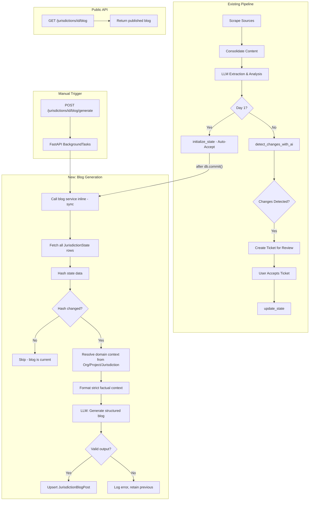

# TICKET: Jurisdiction Blog Post Auto-Generation

**Feature:** Domain-Agnostic Blog Generation from Jurisdiction State  
**Priority:** High  
**Branch from:** `dev`  
**PR Target:** `dev`  
**Estimated Effort:** 3-5 days  

---

## Summary

Automatically generate SEO-friendly blog posts (Markdown) from the **Jurisdiction State (Compliance Ledger)** whenever regulatory data changes or is first scraped. The blog content adapts to **any domain** — EOR policies, environmental regulations, data privacy, tax compliance, etc. — by pulling context from the Organization's industry, the Project's master prompt, and the Jurisdiction's monitoring prompt. No hardcoded domain assumptions.

---

## Background & Motivation

- The platform already scrapes regulatory sources, extracts key-value compliance data via LLM, and stores it as the **"Golden Record"** in `jurisdiction_states`.
- Today, that data is only viewable via the internal dashboard. There's no public-facing content layer.
- This feature bridges that gap: when jurisdiction state changes, an LLM generates a structured blog post grounded **exclusively** in confirmed data (anti-hallucination).
- Blog posts serve as SEO landing pages per jurisdiction (e.g., `/blog/eor-guide-california`, `/blog/gdpr-compliance-germany`, `/blog/banking-regulations-singapore`).
- The content domain is **not hardcoded**. An EOR company gets employment law guides. A fintech company gets banking regulation summaries. The system derives context from existing fields: `Organization.industry`, `Project.master_prompt`, and `Jurisdiction.prompt`.

---

## Architecture Decision: Grounded Context (Not RAG)

The `JurisdictionState` table is already a curated, confirmed dataset. Instead of building a vector store (RAG), we:
1. Fetch all confirmed `JurisdictionState` rows for the jurisdiction
2. Format them as a strict factual context block
3. Pass to LLM with an anti-hallucination system prompt

This is simpler, cheaper, and more reliable for structured data we already own.

---

## Architecture Decision: Domain-Agnostic by Design

The blog generation system **does not hardcode any industry or domain** (e.g., EOR, fintech, healthcare). Instead, it derives domain context at runtime from three existing database fields:

| Field | Model | Example Values |
|-------|-------|----------------|
| `industry` | `Organization` | "EOR", "Financial Services", "Healthcare", "Environmental" |
| `master_prompt` | `Project` | "Monitor employment regulations across APAC", "Track GDPR compliance" |
| `prompt` | `Jurisdiction` | "Focus on minimum wage and termination laws", "Monitor capital adequacy" |

These fields already exist and are already injected into LLM extraction prompts (see `consolidated_extraction_service.py`). The blog service follows the same pattern — traversing `Jurisdiction → Project → Organization` to gather context, then injecting it into prompt templates.

**Why this matters:**
- No code changes needed when a new industry signs up
- An EOR customer gets employment law guides; a fintech customer gets banking regulation summaries — from the same codebase
- The `JurisdictionState` field keys (`minimum_wage`, `capital_requirements`, `data_retention_period`) are themselves domain-specific, and the LLM organizes blog sections around whatever keys exist
- SEO metadata (title, keywords, description) are generated contextually, not from a hardcoded template

---

## System Flow



---

## Implementation Steps

### Step 1: Data Model — `JurisdictionBlogPost`

**File:** `app/api/modules/v1/jurisdictions/models/jurisdiction_blog_post.py`

Create a new SQLModel table to store generated blog content.

```python
class JurisdictionBlogPost(SQLModel, table=True):
    __tablename__ = "jurisdiction_blog_posts"

    id: UUID  # PK, default uuid4
    jurisdiction_id: UUID  # FK -> jurisdictions.id, unique, indexed
    title: str  # LLM-generated title for the blog post
    slug: str  # URL-safe slug, unique, indexed (e.g., "eor-guide-california")
    content: str  # Full Markdown body (sa_column=Column(Text))
    content_hash: str  # SHA-256 hash of the state data used to generate
    meta_description: str  # SEO meta description, max ~160 chars (sa_column=Column(Text))
    keywords: list[str]  # SEO keywords (sa_column=Column(JSON))
    is_published: bool  # Default False — allows draft/review before publish
    published_at: Optional[datetime]  # When it was published (separate from generated_at)
    generated_at: datetime  # When the LLM generated this version
    generation_model: str  # Which LLM model was used (for tracking/debugging)
    version: int  # Incremented on each regeneration, default 1
    created_at: datetime  # Row creation timestamp
    updated_at: datetime  # Row update timestamp

    # Relationship
    jurisdiction: "Jurisdiction" = Relationship()
```

**Key constraints:**
- `UniqueConstraint("jurisdiction_id")` — one blog post per jurisdiction
- `slug` must be unique and indexed
- `content_hash` enables idempotency (skip regeneration if state hasn't changed)

**After creating the model**, register it in the jurisdictions `models/__init__.py` and run:
```bash
alembic revision --autogenerate -m "add jurisdiction_blog_posts table"
```
**Review the generated migration** before applying — verify only the new table is created.

---

### Step 2: Pydantic Schemas

**File:** `app/api/modules/v1/jurisdictions/schemas/blog_schema.py`

```python
class BlogPostResponse(BaseModel):
    """Response schema for a jurisdiction blog post."""
    id: UUID
    jurisdiction_id: UUID
    title: str
    slug: str
    content: str
    meta_description: str
    keywords: list[str]
    is_published: bool
    published_at: Optional[datetime]
    generated_at: datetime
    version: int

    model_config = ConfigDict(from_attributes=True)


class BlogGenerateResponse(BaseModel):
    """Response schema after triggering blog generation."""
    jurisdiction_id: UUID
    status: str  # "generated", "skipped" (hash unchanged), "failed"
    generated_at: Optional[datetime]
    version: Optional[int]


class BlogLLMOutput(BaseModel):
    """Pydantic model for validating structured LLM output."""
    title: str
    meta_description: str = Field(max_length=160)
    keywords: list[str] = Field(min_length=1, max_length=10)
    content: str = Field(min_length=100)
```

`BlogLLMOutput` is used as `response_model` in the LLM call to enforce structure validation via instructor/Pydantic integration already in the OpenRouter provider.

---

### Step 3: LLM Prompts

**File:** `app/api/modules/v1/jurisdictions/prompts/blog_prompts.py`

Create **two** prompt templates. These are **domain-agnostic** — they use placeholder variables that the service injects at runtime from `Organization.industry`, `Project.master_prompt`, and `Jurisdiction.prompt`.

#### System Prompt (Anti-Hallucination + Domain Context)

```python
BLOG_SYSTEM_PROMPT = """You are an expert content writer specializing in \
regulatory compliance, policy analysis, and industry-specific guidance.

DOMAIN CONTEXT (tailor your content to this):
- Industry: {industry}
- Organization Type: {org_type}
- Project Focus: {project_prompt}
- Jurisdiction Monitoring Scope: {jurisdiction_prompt}

CRITICAL RULES:
1. You must ONLY use the facts provided in the Context section below.
2. Do NOT invent, assume, or infer any data not explicitly present \
in the Context.
3. Tailor the writing style, terminology, and section structure to \
match the Industry and Project Focus above. For example:
   - An EOR company → employment law guide for HR professionals
   - A fintech company → banking regulation summary for compliance teams
   - A healthcare org → healthcare regulation brief for administrators
4. If a data point that would typically be expected for this industry/domain \
is missing from the Context, include a section for it stating: \
"Information currently unavailable — pending regulatory data collection."
5. Do NOT reference the source of the data or mention "the context" \
in your output.
6. Write in a professional, informative tone appropriate for the \
target industry audience.
7. Structure the content with clear Markdown headings (##), bullet points, \
and tables where appropriate.
8. Include a brief executive summary at the top.

OUTPUT FORMAT:
Return a JSON object with these exact keys:
- title: A clear, SEO-friendly title relevant to the industry and \
jurisdiction
- meta_description: A 120-160 character SEO meta description
- keywords: An array of 3-8 relevant SEO keywords for the specific domain
- content: The full blog post body in Markdown format
"""
```

#### Content Prompt Template

```python
BLOG_CONTENT_PROMPT = """Generate a comprehensive regulatory compliance guide \
for the jurisdiction: {jurisdiction_name}.

Industry: {industry}
Project Focus: {project_prompt}

Context (ONLY use these confirmed facts):
---
{formatted_state}
---

The guide should:
1. Cover all regulatory areas present in the Context.
2. Organize sections based on the actual data fields available — do NOT \
assume a predefined section structure.
3. For any topic commonly expected in the "{industry}" industry that is \
NOT covered in the Context, include a placeholder section noting the \
information is pending.
4. Use tables for comparison data where appropriate.
5. Adapt terminology and depth to the target industry audience.
"""
```

#### How Domain Context Is Resolved

The service gathers context from the existing model hierarchy at generation time:

```python
# In BlogGenerationService, before calling the LLM:
jurisdiction = db.get(Jurisdiction, jurisdiction_id)
project = jurisdiction.project  # via FK relationship
organization = project.organization  # via FK relationship

prompt_context = {
    "industry": organization.industry or "General Compliance",
    "org_type": organization.org_type or "",
    "project_prompt": project.master_prompt or "Regulatory monitoring",
    "jurisdiction_prompt": jurisdiction.prompt or "",
    "jurisdiction_name": jurisdiction.name,
    "formatted_state": formatted_state,  # from JurisdictionState rows
}

system_prompt = BLOG_SYSTEM_PROMPT.format(**prompt_context)
user_prompt = BLOG_CONTENT_PROMPT.format(**prompt_context)
```

This means:
- An EOR company with `industry="EOR"` and `master_prompt="Monitor employment regulations"` gets employment law blog posts
- A fintech company with `industry="Financial Services"` and `master_prompt="Track banking compliance"` gets banking regulation summaries
- **No code changes needed** when a new industry signs up — the prompts adapt automatically

> **This follows the exact same pattern** already used in `consolidated_extraction_service.py` where `jurisdiction.prompt` and project context are injected into every extraction LLM call.

---

### Step 4: Blog Generation Service

**File:** `app/api/modules/v1/jurisdictions/service/blog_generation_service.py`

This is the core service. It must support **both sync (Celery) and async (route)** contexts.

#### Key Methods

```
BlogGenerationService
├── __init__(db: Session | AsyncSession)
├── generate_blog_post_sync(jurisdiction_id: UUID) -> dict
│   └── Used by Celery tasks (sync Session)
├── generate_blog_post_async(jurisdiction_id: UUID) -> dict
│   └── Used by FastAPI route handler (async AsyncSession)
├── _resolve_domain_context(jurisdiction) -> dict
│   └── Traverses Jurisdiction → Project → Organization
│       Returns {industry, org_type, project_prompt, jurisdiction_prompt, jurisdiction_name}
├── _build_state_context(state_map: dict) -> tuple[str, str]
│   └── Returns (formatted_context, content_hash)
├── _slugify(name: str, industry: str) -> str
│   └── Converts jurisdiction name + industry to URL-safe slug
│       e.g., "eor-guide-california", "gdpr-compliance-germany"
└── _upsert_blog_post(...) -> JurisdictionBlogPost
    └── Creates or updates the blog post row
```

#### Logic Flow (both sync and async follow the same flow)

1. **Fetch jurisdiction + hierarchy** — get the `Jurisdiction` record, then traverse to `Project` and `Organization` to collect domain context:
   - `organization.industry` (e.g., "EOR", "Financial Services", "Healthcare")
   - `organization.org_type` (e.g., "Enterprise", "Startup")
   - `project.master_prompt` (e.g., "Monitor employment regulations across APAC")
   - `jurisdiction.prompt` (e.g., "Focus on minimum wage and termination laws")
   - `jurisdiction.name` (e.g., "California", "Germany")
2. **Fetch state** — get all `JurisdictionState` rows for the jurisdiction
3. **Handle empty state** — if no confirmed data exists:
   - Generate a "Coming Soon" placeholder blog post
   - Set `is_published = False`
   - Return early with `status: "placeholder"`
4. **Format context** — convert state rows into a strict factual text block (domain-agnostic — uses whatever field keys exist):
   ```
   - minimum_wage: $16.00/hr (confirmed 2026-01-15)
   - working_hours: 40 hours/week (confirmed 2026-01-15)
   - capital_requirements: $500,000 minimum (confirmed 2026-02-01)
   - ...
   ```
5. **Hash context** — SHA-256 hash of the formatted state string
6. **Check existing** — if a `JurisdictionBlogPost` exists with the same `content_hash`:
   - Skip regeneration
   - Return `status: "skipped"`
7. **Call LLM** — using `LLMManager`:
   - **Sync context**: use `generate_with_tracking_sync()` or `async_to_sync(generate_with_tracking)(...)` (follow the pattern in `AIExtractionService.run_consolidated_analysis()` at `app/api/modules/v1/scraping/service/llm_service.py`)
   - **Async context**: use `await generate_with_tracking()`
   - Pass `system_prompt=BLOG_SYSTEM_PROMPT.format(**prompt_context)` — injects industry, org_type, project_prompt, jurisdiction_prompt
   - Pass user prompt from `BLOG_CONTENT_PROMPT.format(**prompt_context)` — injects jurisdiction_name, industry, formatted_state
   - Pass `response_model=BlogLLMOutput` for Pydantic validation
   - Use `ModelCategory.BALANCED` (good quality, reasonable cost)
8. **Handle LLM failure** — if the call raises, log the error. If a previous blog post exists, keep it. Return `status: "failed"`.
9. **Upsert** — create or update `JurisdictionBlogPost`:
   - Set `title`, `slug`, `content`, `meta_description`, `keywords` from LLM output
   - Set `content_hash` from step 5
   - Increment `version` if updating
   - Set `generated_at = now()`
   - Set `generation_model` from the LLM response metadata
   - On a new post: `is_published = False` (requires explicit publish)
   - On an update to an already-published post: keep `is_published = True`
10. **Commit** — in the sync Celery context (inline call), the service commits. In the async route context (`BackgroundTasks`), the background task manages its own session.

#### Sync/Async Pattern Reference

Look at how `AIExtractionService` in `app/api/modules/v1/scraping/service/llm_service.py` handles this:
- It wraps async LLM calls with `async_to_sync()` for the sync (Celery) context
- The blog service should follow the exact same pattern

---

### Step 5: Execution Strategy — Inline Sync + FastAPI BackgroundTasks (No New Celery Worker)

#### Why Not a Separate Celery Task/Worker?

| Factor | Celery Worker | Inline + BackgroundTasks |
|--------|--------------|-------------------------|
| **Infra cost** | New worker process to deploy & monitor | Zero — reuses existing Celery worker + FastAPI server |
| **Current state** | Only `scraping` and `processing` queues active; `persistence` unused | BackgroundTasks already used in codebase (waitlist, org invites, specialists) |
| **Blog workload** | Over-engineered for 1 LLM call per state change | Well within capacity — low-volume, non-critical side effect |
| **Retries** | Built-in `max_retries` | Manual trigger endpoint covers retries; data is safe in `JurisdictionState` regardless |
| **DB sessions** | Needs separate `SyncSessionLocal()` | Inline reuses existing sync session; BackgroundTasks uses its own async session |

#### Two Execution Paths

**Path 1: Auto-trigger (Day 1 + State Update)** — Called inline after `db.commit()` in the existing Celery consolidation task. The consolidation task already runs 30-60+ seconds for LLM extraction, so adding 5-10 seconds for blog generation is negligible. If it fails, it's caught and logged — the scraping pipeline is not affected.

**Path 2: Manual trigger (API route)** — Uses FastAPI `BackgroundTasks` (same pattern as waitlist emails, org invitations, specialist notifications already in the codebase). The user gets an immediate 202 response while generation runs in the background.

---

### Step 6: Wire Up Auto-Triggers

#### 6a. Day 1 Auto-Accept Trigger

**File:** `app/api/modules/v1/scraping/service/consolidated_extraction_service.py`  
**Location:** Inside `execute()`, **after** the `db.commit()` that follows `_handle_day_one_auto_accept()` (~line 170)

```python
# EXISTING CODE (around line 163-170):
self._handle_day_one_auto_accept(job, analysis_result, state_service)
self.db.commit()

# ADD AFTER db.commit():
try:
    from app.api.modules.v1.jurisdictions.service.blog_generation_service import (
        BlogGenerationService,
    )
    blog_service = BlogGenerationService(self.db)
    blog_result = blog_service.generate_blog_post_sync(job.jurisdiction_id)
    logger.info(
        f"Blog generation for jurisdiction {job.jurisdiction_id} "
        f"(Day 1): {blog_result.get('status', 'unknown')}"
    )
except Exception as e:
    logger.warning(
        f"Blog generation failed (non-blocking): {e}"
    )
```

> **CRITICAL:** The trigger goes **after** `db.commit()`, not inside `_handle_day_one_auto_accept()` or `initialize_state()`. Those methods do NOT commit — placing an LLM call before commit would hold the transaction open for seconds and risk connection pool exhaustion.

> **Why inline is safe here:** The consolidation task is already a long-running Celery job (30-60s+). Adding a 5-10s blog LLM call is negligible. The `try/except` ensures blog failure never breaks the scraping pipeline.

#### 6b. Change Acceptance — No Auto-Trigger (Manual Only)

Blog regeneration is **not** triggered automatically on change acceptance. Rationale:
- Users accept changes one at a time (or in bulk). Triggering blog regeneration per-change would cause N redundant LLM calls for N accepted changes, wasting cost and producing N-1 throwaway intermediate blog versions.
- Instead, the user triggers regeneration manually via `POST /jurisdictions/{id}/blog/generate` after they've finished accepting all relevant changes.
- The content hash still provides idempotency — if no state actually changed, the manual trigger returns `"skipped"` instantly.

---

### Step 7: API Routes

**File:** `app/api/modules/v1/jurisdictions/routes/blog_routes.py`

```python
router = APIRouter(
    prefix="/organizations/{organization_id}/jurisdictions",
    tags=["Jurisdiction Blog"],
    dependencies=[
        Depends(TenantGuard),
        Depends(OrgResourceGuard),
        Depends(require_billing_access),
    ],
)
```

#### `GET /{jurisdiction_id}/blog`

- Fetch the `JurisdictionBlogPost` for the given jurisdiction
- If `is_published=False`, only return if the user has org access (they can preview drafts)
- Return using `success_response()`
- If no blog post exists, return 404 with `NOT_FOUND` error code

#### `POST /{jurisdiction_id}/blog/generate`

- Manual trigger to regenerate the blog from current state
- Uses FastAPI `BackgroundTasks` to run generation without blocking the response:

```python
@router.post("/{jurisdiction_id}/blog/generate")
async def generate_blog(
    organization_id: UUID,
    jurisdiction_id: UUID,
    background_tasks: BackgroundTasks,
    db: AsyncSession = Depends(get_db),
):
    # Verify jurisdiction exists and belongs to org (fast check)
    # Then dispatch to background:
    background_tasks.add_task(
        _generate_blog_in_background, jurisdiction_id
    )
    return success_response(
        status_code=202,
        message="Blog generation started.",
        data={"jurisdiction_id": str(jurisdiction_id)},
    )


async def _generate_blog_in_background(jurisdiction_id: UUID):
    """Background task wrapper that opens its own sync session."""
    from app.api.db.database import SyncSessionLocal
    with SyncSessionLocal() as db:
        service = BlogGenerationService(db)
        service.generate_blog_post_sync(jurisdiction_id)
```

- Returns 202 Accepted — the caller gets an immediate acknowledgment, not the generated post
- Follows the same `BackgroundTasks` pattern used in waitlist, org invitations, and specialist routes

#### `PATCH /{jurisdiction_id}/blog/publish`

- Toggle `is_published` to `True` and set `published_at = now()`
- Return the updated blog post
- Allows a review step between generation and public visibility

#### OpenAPI Docs

**File:** `app/api/modules/v1/jurisdictions/routes/docs/blog_route_docs.py`

Follow the existing pattern in `jurisdiction_route_docs.py` to define:
- `get_blog_responses`, `get_blog_custom_errors`, `get_blog_custom_success`
- `generate_blog_responses`, `generate_blog_custom_errors`, `generate_blog_custom_success`
- `publish_blog_responses`, etc.

---

### Step 8: Register the Router

**File:** `app/api/modules/v1/__init__.py`

Add:
```python
from app.api.modules.v1.jurisdictions.routes.blog_routes import (
    router as blog_router,
)

# In the protected section:
router.include_router(blog_router, dependencies=[Depends(require_approved_user)])
```

---

### Step 9: Custom Exception (Optional)

**File:** `app/api/core/custom_exceptions/exceptions.py`

Only if needed beyond existing `ProcessingError`:

```python
class BlogGenerationError(CustomDomainException):
    """Raised when blog content generation fails."""

    def __init__(self, message: str = ""):
        message = (
            "Unable to generate blog content at this time. "
            "Please try again later."
            if not message
            else message
        )
        super().__init__(message=message, code="PROCESSING_ERROR")
```

Add `"BLOG_GENERATION_ERROR": 500` to `error_status_code_mapper.py` if using a unique code.

---

## File Inventory

| Action | File Path | Description |
|--------|-----------|-------------|
| **CREATE** | `app/api/modules/v1/jurisdictions/models/jurisdiction_blog_post.py` | Blog post SQLModel |
| **CREATE** | `app/api/modules/v1/jurisdictions/schemas/blog_schema.py` | Request/response schemas |
| **CREATE** | `app/api/modules/v1/jurisdictions/prompts/__init__.py` | Empty init |
| **CREATE** | `app/api/modules/v1/jurisdictions/prompts/blog_prompts.py` | System + content prompts |
| **CREATE** | `app/api/modules/v1/jurisdictions/service/blog_generation_service.py` | Core service |
| **CREATE** | `app/api/modules/v1/jurisdictions/routes/blog_routes.py` | API endpoints |
| **CREATE** | `app/api/modules/v1/jurisdictions/routes/docs/blog_route_docs.py` | OpenAPI docs |
| **CREATE** | `alembic/versions/xxxx_add_jurisdiction_blog_posts.py` | Migration (auto-generated) |
| **CREATE** | `tests/modules/v1/jurisdictions/service/test_blog_generation_service.py` | Service tests |
| **CREATE** | `tests/modules/v1/jurisdictions/routes/test_blog_routes.py` | Route tests |
| **MODIFY** | `app/api/modules/v1/scraping/service/consolidated_extraction_service.py` | Add Day 1 trigger (inline) |
| **MODIFY** | `app/api/modules/v1/__init__.py` | Register blog router |
| **MODIFY** | `alembic/env.py` | Import new model (if not auto-discovered) |

---

## Edge Cases & Handling

| Scenario | Expected Behavior |
|----------|-------------------|
| **Empty state (no confirmed data)** | Generate placeholder post with "Coming Soon" content, `is_published=False` |
| **Partial state (some fields missing)** | LLM generates content for available fields, marks missing as "Information currently unavailable" |
| **LLM call fails (timeout, API error)** | Log error, retain previous blog version (if exists), return `status: "failed"` |
| **LLM returns invalid output** | Pydantic `BlogLLMOutput` validation fails → treat as LLM failure |
| **State unchanged (same hash)** | Skip LLM call entirely, return `status: "skipped"` |
| **Rapid bulk updates (50 field changes)** | Content hash prevents redundant LLM calls — state is hashed before calling LLM, so even if triggered multiple times the second call sees the same hash and returns `"skipped"` |
| **Manual trigger while auto-gen running** | BackgroundTasks runs sequentially per-request; content hash check prevents wasted LLM calls |
| **Jurisdiction deleted** | Blog post row cascades or is soft-deleted alongside jurisdiction |
| **Slug collision** | Append jurisdiction ID suffix: `eor-guide-california-{short_uuid}` |

---

## Testing Requirements

### Unit Tests — Service Layer

**File:** `tests/modules/v1/jurisdictions/service/test_blog_generation_service.py`

| Test | What it Verifies |
|------|------------------|
| `test_generate_blog_post_success` | Happy path: state exists → LLM called → blog upserted |
| `test_generate_blog_post_empty_state` | No state rows → placeholder generated |
| `test_generate_blog_post_hash_unchanged` | Same state hash → LLM NOT called, returns "skipped" |
| `test_generate_blog_post_llm_failure` | LLM raises → previous version retained, returns "failed" |
| `test_generate_blog_post_invalid_llm_output` | LLM returns bad shape → Pydantic rejects → treated as failure |
| `test_generate_blog_post_updates_version` | Existing post + new state → version incremented |
| `test_slug_generation` | Jurisdiction name → correct URL slug |
| `test_slug_collision_handling` | Duplicate slug → UUID suffix appended |
| `test_domain_context_eor` | Org with `industry="EOR"` → LLM system prompt contains EOR context |
| `test_domain_context_fintech` | Org with `industry="Financial Services"` → prompt adapts to fintech |
| `test_domain_context_missing_fields` | Org with no industry, project with no master_prompt → graceful defaults used |
| `test_resolve_domain_context_traversal` | Service correctly traverses Jurisdiction → Project → Organization |

### Unit Tests — Routes

**File:** `tests/modules/v1/jurisdictions/routes/test_blog_routes.py`

| Test | What it Verifies |
|------|------------------|
| `test_get_blog_success` | Published blog post returned with correct schema |
| `test_get_blog_not_found` | No blog post → 404 |
| `test_generate_blog_dispatches_background_task` | POST endpoint adds BackgroundTasks task, returns 202 |
| `test_publish_blog_success` | PATCH sets `is_published=True` and `published_at` |
| `test_publish_blog_not_found` | No blog post to publish → 404 |

### Integration Tests — Trigger Points

| Test | What it Verifies |
|------|------------------|
| `test_day_one_triggers_blog_generation` | After Day 1 auto-accept commit, blog service is called inline |
| `test_change_acceptance_does_not_trigger_blog` | After ticket acceptance commit, blog service is NOT auto-called |
| `test_blog_generation_failure_does_not_break_pipeline` | Blog LLM error is caught, consolidation result still returned |

### Testing Patterns

- Mock `LLMManager` / `generate_with_tracking_sync` — never hit real LLM in tests
- Use `AsyncMock` for async service variant tests
- Mock `db.execute()` returning `Mock(scalars=Mock(return_value=Mock(all=Mock(return_value=[...]))))`
- Follow existing test patterns in `tests/modules/v1/jurisdictions/` and `tests/modules/v1/scraping/`
- One-line docstrings only, no inline comments

---

## Acceptance Criteria

- [ ] `JurisdictionBlogPost` model created and migrated
- [ ] Blog generation service works in both sync (inline Celery) and async (BackgroundTasks) contexts
- [ ] Blog auto-generates on Day 1 auto-accept (inline after commit in consolidation task)
- [ ] Blog regeneration available via manual trigger after change acceptance (no auto-trigger)
- [ ] Blog generation failure does not break the scraping/consolidation pipeline
- [ ] Manual `POST` trigger uses FastAPI `BackgroundTasks` and returns 202
- [ ] `GET` endpoint returns published blog post with correct response schema
- [ ] `PATCH` endpoint publishes/unpublishes a blog post
- [ ] Content hash prevents unnecessary LLM calls when state hasn't changed
- [ ] LLM output validated via Pydantic `BlogLLMOutput` before saving
- [ ] LLM failure preserves previous blog version
- [ ] Empty/partial state handled gracefully
- [ ] All responses use `success_response()` / `error_response()` helpers
- [ ] No try-catch blocks in route handlers
- [ ] `ruff check .` passes with no errors
- [ ] All tests pass: `pytest tests/modules/v1/jurisdictions/`
- [ ] Alembic migration reviewed and contains only the intended table

---

## Implementation Order (Recommended)

1. **Model + Migration** (Step 1) — unblocks everything
2. **Schemas** (Step 2) — needed by service and routes
3. **Prompts** (Step 3) — needed by service
4. **Service** (Step 4) — core logic
5. **Routes + Docs + Registration** (Steps 7-8) — API layer
6. **Wire Triggers** (Step 6) — connect to existing pipeline
7. **Tests** — validate everything
8. **Ruff + Migration Review** — final quality check

---

## Dependencies

- `LLMManager` and `generate_with_tracking_sync()` (already exists in `app/api/core/llm/llm_manager.py`)
- `SyncSessionLocal` (already exists in `app/api/db/database.py`)
- FastAPI `BackgroundTasks` (built-in, no additional dependency)
- `python-slugify` package — check if installed, add to `pyproject.toml` if not. Alternatively, implement a simple slugify utility inline.

---

## Out of Scope (Future)

- Public-facing blog listing page (frontend)
- Blog post version history table (rollback to previous versions)
- Blog post scheduling (publish at a future date)
- Multi-language blog generation
- Blog post analytics / view tracking
- RSS feed generation
